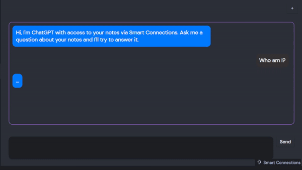
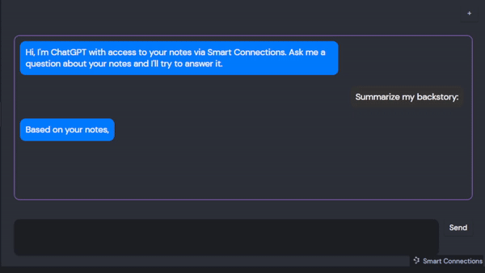

# Smart Connections: AI-Powered Note Connections for Obsidian
[Introducing Smart Connections](https://wfhbrian.com/introducing-obsidian-smart-connections/), the AI-powered plugin for [Obsidian](https://obsidian.md/) that helps you save time and stay organized by connecting you to the most relevant notes in your vault in real-time.

## Features
### Smart Chat: Transform Your Notes into Interactive Conversations
Enhance your note-taking experience with **Smart Chat**, a plugin that turns your notes into an AI-powered interactive chat. Retrieve information, clarify concepts, and explore ideas by engaging in a conversation with your notes.

#### How Smart Chat Works
- To access Smart Chat, open the command palette and select "Smart Connections: Open Smart Chat." If you already have the Smart View pane open, you can also access the Smart Chat by clicking the message icon in the top right.
- In the Smart Chat pane, type your question or message and hit Send or use the shortcut `Shift+Enter`.
- The AI will analyze your notes and provide a relevant response based on the content in your vault.
	- **Note**: Currently, to trigger a search of your notes, you must use a self-referential pronoun (ex. I, me, my, mine, we, us, our, ours).
- You can continue the conversation by replying to the response or asking follow-up questions.

#### Chat Features
- **Context-aware responses**: Smart Chat understands the context of your notes, providing responses that are accurate and relevant to your specific content.
- **Natural language processing**: The AI-powered feature interprets and responds to your questions in a conversational manner, simulating a chat with a real person.
- **Multilingual support**: Smart Chat can understand and respond to queries in multiple languages, allowing you to interact with your notes in your preferred language.
 

##### Coming soon!
- **Note linking**: If a response references a specific note in your vault, Smart Chat will provide a link to that note for quick access.
- **Current-note chat**: Have a conversation based on a specific note instead of the entire vault.

#### Benefits of Smart Chat
- **Efficient Information Retrieval**: Quickly access specific information in your notes without having to search and browse through numerous files.
- **Improved Knowledge Retention**: Engaging with your notes through a conversational interface helps reinforce your understanding and recall of the material.
- **Creative Exploration**: Discover new connections and insights as you interact with your notes, fostering an environment for brainstorming and idea generation.

#### Limitations
- The quality of the responses depends on the content and organization of your notes. Ensure your notes are well-structured and comprehensive for the best experience.
- Smart Chat may occasionally provide incorrect or irrelevant responses due to the limitations of AI understanding. In such cases, rephrase your question or provide more context for better results.

### Smart View

- Notes with multiple matching blocks can be expanded to show the matching blocks.
- Search feature that uses embeddings to search for notes in your vault.
- You can click on a note to open it in the current pane or hold down the `ctrl` or `cmd` to open it in a new pane.
- To preview the notes in the Smart Connections Pane, you can hold down the `ctrl` or `cmd` key to preview the note while hovering over it.
- You can drag and drop a link from the to become a link in your note or open it as a new tab.

### External Connections
**Coming soon:** See connections to external content!

Currently taking requests for which external content you would like connected. Please comment on [this issue](https://github.com/brianpetro/obsidian-smart-connections/issues/27) with your suggestions.

### Section 'block' matching
- Smart Connections plugin will use 'blocks' of text in your notes to find the most relevant connections.
- Currently, a 'block' is a section of text that is separated by a heading.
    - For example, if you have a note that contains the following text: `# Header 1\nThis is a block of text.\n# Header 2\nThis is another block of text`, then the plugin will search for similar blocks of text in addition to making smart connections with similar files.

### Highlight to find Smart Connections

- Highlighted text will be used to find Smart Connections when you run the "Find Smart Connections" command

## Installation

### Instructions
1. Install the plugin from the community plugins tab in Obsidian.
2. Create an account at [OpenAI](https://beta.openai.com/) and retrieve your API key from the [API Keys](https://beta.openai.com/account/api-keys) page.
3. Open the plugin settings and enter your API key.

**Note:** The plugin will not work without an OpenAI API key.

## How it works
- The Smart Connections Pane is opened when you activate the plugin. You can also open it from the command palette with the "Open: View Smart Connections" command.
- Each time you open a note, the plugin will search for similar notes in your vault and display them in the Smart Connections Pane (sidebar). The Smart Connections Pane will display the most similar notes first using the cosine similarity of the note's embeddings.
- The plugin will only search for similar notes in the current vault. It will not search for similar notes in other vaults.

### Initial processing
- The plugin will process all your notes and store the embeddings in a hidden folder in your vault called `.smart-connections` in a file called `embeddings.json`. This file is used to cache the embeddings of your notes so that they do not need to be recalculated each time you open a note. `file.mtime` is used to determine if a note has been modified since the last time Smart Connections calculated the embeddings. The `embeddings.json` file can get to be quite large, so it is recommended that you exclude the folder from your sync settings.
- The initial processing may take a while, depending on the number of notes in your vault.
- The plugin will only process notes that are in the current vault. It will not process notes in other vaults.
- The cost of the initial processing is proportional to the number of notes in your vault. Without any exclusions configured in the settings, the amount of tokens used in the initial processing is approximately 2X the total number of "tokens" in your entire vault. A rough calculation for this is `the total number of characters in the vault` divided by `2`. For example, if your vault contains 100,000 characters, then the initial processing will cost approximately 50,000 tokens. The current token cost is $0.0004 per 1,000 tokens (as of [2021-08-01](https://openai.com/api/pricing/)) which is estimated to be ~$1 USD for 3,000 pages (assuming 800 tokens per page).

## Limitations
- The plugin is currently a desktop-only plugin.
  - **Coming soon**: mobile-support for the _Smart Chat_ feature.

## Settings
- `API Key` - Enter your OpenAI API key.
- `File Exclusions` - Enter a comma-separated list of file or folder names to exclude from the search completely. For example, if you want to exclude all files that contain the word "drawings" in the file name, you can enter "drawings" in the field. If you want to exclude all files that contain the word "drawings" or "prompts" in the file name, you can enter "drawings,prompts" in the field.
- `Folder Exclusions` - similar to `File Exclusions` but only matches folders instead of anything in the file path.
- `Path Only` - Enter a comma-separated list of file or folder names. Notes matching these patterns will use only the file names and paths of files to make connections. 
- `Heading Exclusions` - Enter a comma-separated list of headings to exclude. Smart Connections will exclude 'Blocks' with headings that match the Heading Exclusions from the search. 
	- For example, use this if you have a commonly occurring "Archive" section in many files and do not want the contents to be included when making smart connections.  
	- This only applies to 'blocks' and does not change the content used for matching entire files.
- `Show Full Path` - Show the full path of the file in the Smart Connections Pane. If turned off, only the file name will be shown.

### Settings (Advanced)
- `Log Render` - this will print logs containing details about the embedding process.
- `Log Render Files` - this will print logs containing details about the files that are being processed.
- `Skip Sections` - skips making connections to specific sections within your notes. This feature is not recommended but may be helpful in some situations, like debugging.
- `Previously Failed Files` - this will show a list of previously failed files. You can retry the failed files by clicking the "Retry" button.
- `Force Refresh` - this will force the plugin to recalculate the embeddings for all files in your vault. This plugin is designed so that you SHOULD NOT need to use this feature.

## Error handling
- If you encounter an error, please open an issue on the [GitHub repository](https://github.com/brianpetro/obsidian-smart-connections/issues).
- Failed requests due to rate limitting will be retried up to 3 times using exponential backoff, then the plugin will stop trying to process the file.
- After the 3rd failed request, the plugin will save the failed request to a file called `failed-embeddings.txt` in the `.smart-connections` folder in your vault. 
- You can manually retry the failed files using the "Retry" button in the settings.

## Under the hood
The plugin integrates [OpenAI Embeddings](https://beta.openai.com/docs/guides/embeddings), a technology from the organization behind ChatGPT, to use AI that finds connections between notes. Instead of matching keywords, the AI interprets your notes as 1,536-dimension vectors!

*Note: This does mean that your notes are sent to OpenAI's servers to be processed and are subject to their [Terms of Service](https://openai.com/terms).* The `File Exclusions` and `Folder Exclusions` settings are designed to help you control which notes are processed.

## Developing Add-ons
- **Coming soon**: Use Smart Connections in your plugin! Prevent the headaches of managing vector storage and save your users money by reusing their existing embeddings.
	- **Note**: This feature is currently in beta. Create a GitHub issue if you want to learn how to use the beta version of this feature.
- This plugin is designed to manage the vector interpretation ("embeddings") of the notes in your vaults. The requirements for managing this can be extensive.
- While there are many ways to interpret the vector relationships and make them useful this plugin is focused on delivering the core capabilities required to utilize such a system.

## About the Author
WFH Brian is an entrepreneur and consultant with extensive experience in artificial intelligence (AI) systems. Passionate about helping businesses unlock the potential of AI, he offers a range of services designed to make AI accessible and impactful for organizations of all sizes.

### AI Tutoring and Education
Brian's AI tutoring and education services transform clients from being anxious about AI's impact on their businesses to feeling confident and capable of harnessing its potential. He demystifies the latest AI advancements, enabling clients to make informed decisions, actively engage in AI-related discussions, and identify areas where AI can add value to their businesses.

### Prompt Development Workshop
Maximize the benefits of AI tools like ChatGPT with Brian's prompt development workshops. He works closely with clients to optimize their proprietary prompts, streamline workflows, and enhance overall productivity. By identifying and improving key areas, Brian ensures clients make the most of the available AI technologies.

### AI Strategy Consulting
For businesses seeking to adopt AI, Brian provides comprehensive AI strategy consulting services. From conceptualizing ideas to developing actionable plans, his expert guidance covers all aspects of AI transformation. Brian's commitment to delivering tangible results and ROI ensures clients can confidently navigate the AI landscape.

To discover more about WFH Brian's services or to book a consultation, please visit [his website](https://wfhbrian.com/services). Don't miss the opportunity to take your business to new heights with expert AI insights from WFH Brian. If you find Smart Connections valuable, spread the word and help others benefit from his expertise as well!