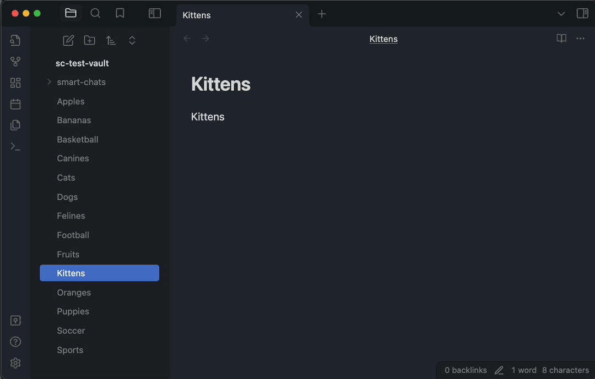
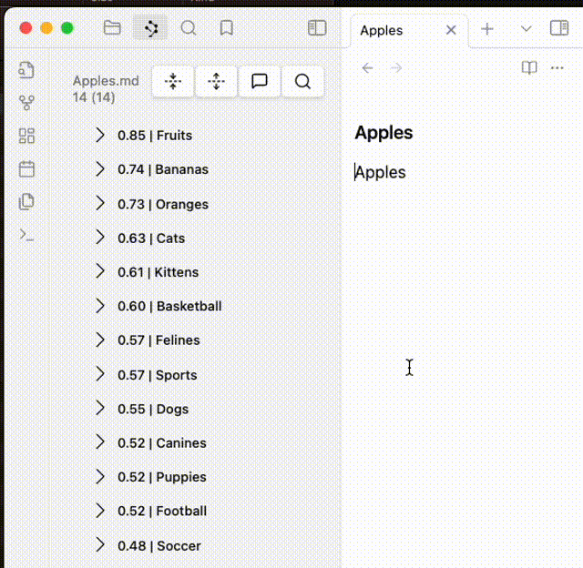
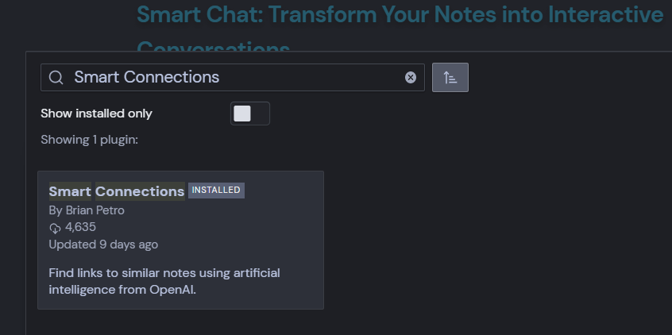
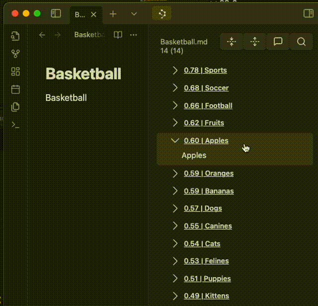
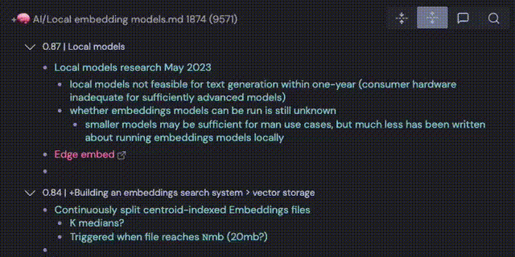
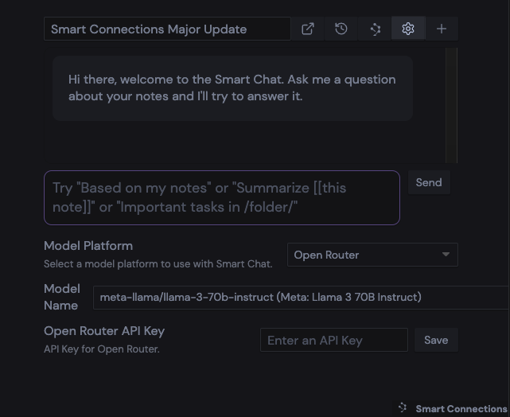
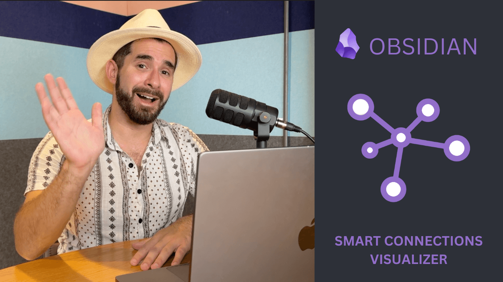
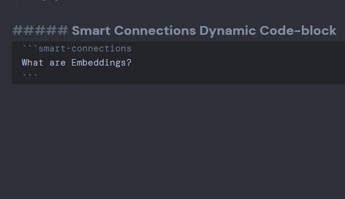
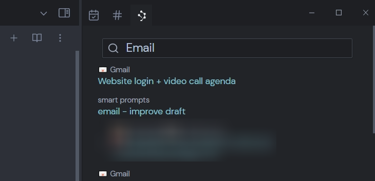

# 🧩 Smart Connections: AI-Powered Note Connections `v2.3`

**Spend less time** *linking*, *tagging* and *organizing* because **Smart Connections *finds relevant notes*** so you don't have to!

- *Supports **local chat models** like **Llama 3** through **Ollama**, **LM Studio** and many more.*
- *100s of API models including Anthropic **Claude**, Google **Gemini**, and OpenAI **GPT-4**.*
- *Supports **local embedding models**.*
- *Saves **chats as notes** (markdown) and **canvas** (in early release).*
- *See what **[people are saying](#user-testimonials)**.*

> [!TIP]
> Join the next [Lean Coffee session](https://lu.ma/calendar/cal-ZJtdnzAdURyouM7) to discuss future features & improvements.

Hey there, I'm Brian, the mind behind Smart Connections (still human, at this point 🤪). I laugh at my own jokes, like to use emojis, and think about thinking.

Smart Connections is a [mission-driven](https://youtu.be/RtlpPTrEQ7c) software that's funded by users. Smart Connections is designed by an individual to enhance individual abilities so you can reach your goals and realize your visions for the future with software that's aligned with you. Follow [@wfhbrian](https://x.com/wfhbrian) for feature sneak peeks and other updates about the process of developing Smart Connections.

> [!NOTE]
> Documentation site coming soon at [docs.smartconnections.app](https://docs.smartconnections.app). Contribute to the docs [here](https://github.com/brianpetro/Smart-Connections-Docs).

## A brief history
The journey of Smart Connections is one I directly share with you. Smart Connections isn't just about some new features in Obsidian; it's a reflection of our shared experiences, your invaluable feedback, and a testament to what we can achieve together in the Obsidian community. A journey that's been both exhilarating and profoundly educational.

Obsidian wasn't my first attempt at trying to manage and make sense of my notes. And in late 2022, like what has happened with all of my past attempts, the system I had built in Obsidian was beginning to fall apart. There were too many notes and I didn't having enough time to organize, link, tag, and otherwise manage them properly.

Smart Connections started as way for me to keep track of my thousands of notes, prevent rework, and make new connections by showing relevant notes/excerpts alongside whatever note I was currently working on via the Smart View.

Soon after its initial release, the community recognized the opportunity for Smart Chat, so you can now chat with your notes, using the same technology behind the Smart View.

From there, the Smart Connections community has continued playing a major part in its progress, from testing early-release versions, coming up with ideas for new features, solving issues, and enabling me with the resources necessary to spend more time building software that enables individuals with AI!

## Mission
Smart Connections is about more than technology; it's about community, collaboration, and the shared journey of enhancing our note-taking experiences. Here's a brief look at the motivation behind Smart Connections, followed by heartfelt testimonials from our users.

The Smart Connections mission is making AI technology for individuals, emphasizing accessibility, and fostering a community-driven development. Unlike many tools that prioritize corporate interests, Smart Connections is a testament to the power of open-source, user-supported software in making advanced technology accessible to everyone.

Open-source has been around for a long time. Still, over the past decade, the primary beneficiary of open source has shifted away from individuals and toward corporate interests. This shift can be seen by looking at the many VC-funded "open-source" projects.

In contrast, Smart Connections is designed for individuals, emphasizing accessibility for the less technical, and is funded directly by users.

> "I believe that open-source software that serves individuals directly, like Smart Connections, is one of the best ways we can ensure equitable access to AI-provided opportunities."
> 🌴 Brian

## Discover Smart Connections
Smart Connections goes beyond just being a plugin; it's a bridge that connects your thoughts, notes, and insights in Obsidian, making your information management seamless and intuitive. Let's explore what makes Smart Connections stand out:

### Smart View: AI-Powered Note Discovery
The Smart View feature dynamically offers real-time suggestions of related notes, based on your current activity. It uses AI embeddings to surface relevant notes based on your current context. This not only enhances your creativity but also significantly improves your productivity by illuminating connections you might not have seen.

### Smart Chat: AI Conversations Based on Your Notes
Transform your note-taking with Smart Chat. This feature allows you to have dynamic conversations with your notes, powered by the latest AI technology. Whether you're brainstorming, seeking information, or exploring your notes in new ways, Smart Chat makes it possible.

*AI chat models available in the Smart Chat are listed below.*

## User Testimonials
Hearing from those who use Smart Connections brings to life the impact it has on individuals' workflows and creativity. 

Here's what some of them have to say:

- "Smart Connections is revolutionary for my process of attempting to wrangle decades of sprawling unorganized notes, journals etc. Amazing work! Look forward to seeing it evolve." - Ronny
- ["I've switched over from Mem to Obsidian when I found this plugin"](https://discord.com/channels/686053708261228577/694233507500916796/1091164112425320538)
- ["I actually decided to start using Obsidian BECAUSE of Smart Connections."](https://github.com/brianpetro/obsidian-smart-connections/issues/441#:~:text=I%20actually%20decided%20to%20start%20using%20Obsidian%20BECAUSE%20of%20Smart%20Connections.)
- [Let me take the opportunity to say what a brilliant plug in you have created it has completely transformed the way I am able to use notes.](https://github.com/brianpetro/obsidian-smart-connections/issues/592#issuecomment-2104332746:~:text=Let%20me%20take%20the%20opportunity%20to%20say%20what%20a%20brilliant%20plug%20in%20you%20have%20created%20it%20has%20completely%20transformed%20the%20way%20I%20am%20able%20to%20use%20notes)
- [I can already see this will be a game-changer for my research and personal note-taking.](https://github.com/brianpetro/obsidian-smart-connections/issues/589#issuecomment-2104948387:~:text=I%20can%20already%20see%20this%20will%20be%20a%20game%2Dchanger%20for%20my%20research%20and%20personal%20note%2Dtaking.)
- [Hi Brian, you've created one of the most powerful Obsidian's plugin, in the name of all the Obsidian users, i really want to thank you ! It makes our lives easier and more creative ❤️](https://www.youtube.com/watch?v=tGZ6J63UZmw&lc=UgwRE_J-yZ5QVC6b6yJ4AaABAg)
- [thanks so much for this and the wonderful plugin.](https://www.youtube.com/watch?v=tGZ6J63UZmw&lc=UgzgQhv2CA0easzk7np4AaABAg)
- ["This is such a game-changingly helpful plugin"](https://github.com/brianpetro/obsidian-smart-connections/issues/329#issuecomment-2002162224:~:text=This%20is%20such%20a%20game%2Dchangingly%20helpful%20plugin)
- ["This plugin has become a vital part of my life"](https://github.com/brianpetro/obsidian-smart-connections/issues/120#issuecomment-1492842117:~:text=This%20plugin%20has%20become%20a%20vital%20part%20of%20my%20life)
- ["This is by far my favourite Obsidian plug-in and it is immensely helpful. I'll be doing a full video about using it for PhD research"](https://github.com/brianpetro/obsidian-smart-connections/discussions/371#discussioncomment-7977910:~:text=This%20is%20by%20far%20my%20favourite%20Obsidian%20plug%2Din%20and%20it%20is%20immensely%20helpful.%20I%27ll%20be%20doing%20a%20full%20video%20about%20using%20it%20for%20PhD%20research)
- ["It's astonishing the power it provides to deal with scientific research and scientific articles included in the vault."](https://github.com/brianpetro/obsidian-smart-connections/issues/250#issuecomment-1595108987:~:text=It%27s%20astonishing%20the%20power%20it%20provids%20to%20deal%20with%20scientific%20research%20and%20scientific%20articles%20included%20in%20the%20vault.)
- ["Smart Connections is easily in my Top 3 [plugins], it changes radically the use of [Obsidian], many thanks for that."](https://github.com/brianpetro/obsidian-smart-connections/issues/64#issuecomment-1484212168:~:text=Smart%20connections%20is%20easily%20in%20my%20Top%203%2C%20it%20changes%20radically%20the%20use%20of%20the%20Soft%2C%20many%20thanks%20for%20that.)
- ["[Smart Connections] significantly changed how I use PKM"](https://discord.com/channels/686053708261228577/710585052769157141/1091163849190801468)
- ["This is an AWESOME little plugin. Thanks for sharing."](https://forum.obsidian.md/t/introducing-smart-chat-a-game-changer-for-your-obsidian-notes-smart-connections-plugin/56391/8?u=wfh#:~:text=This%20is%20an%20AWESOME%20little%20plugin.%20Thanks%20for%20sharing.)
- ["Hopping on to also say thanks. I have been wanting this feature in something ever since reading about tad starners remembrance agent in the 90s! And this is even better."](https://github.com/brianpetro/obsidian-smart-connections/issues/47#issuecomment-1471441869:~:text=Hopping%20on%20to%20also%20say%20thanks.%20I%20have%20been%20wanting%20this%20feature%20in%20something%20ever%20since%20reading%20about%20tad%20starners%20remembrance%20agent%20in%20the%2090s!%20And%20this%20is%20even%20better.)
- ["I'm having so much fun using your chat plugin to search my notes better and get insights."](https://github.com/brianpetro/obsidian-smart-connections/issues/57#:~:text=Hi%2C-,I%27m%20having%20so%20much%20fun%20using%20your%20chat%20plugin%20to%20search%20my%20notes%20better%20and%20get%20insights,-.%20I%20was%20just)
- ["This is undoubtedly an excellent plugin that makes a significant improvement in how we interact with our notes."](https://github.com/brianpetro/obsidian-smart-connections/pull/219#issuecomment-1562572364:~:text=This%20is%20undoubtedly%20an%20excellent%20plugin%20that%20makes%20a%20significant%20improvement%20in%20how%20we%20interact%20with%20our%20notes.)
- "I have been using Smart Connections with Obsidian. It is excellent. I am finding more and more uses for it. I am intrigued by the idea of being able to use a local embedding model." - Eamonn
- "Huge fan of Smart Connections so much that I even [wrote a post about how I use it to massively save time on summarizing legal cases](https://careylening.substack.com/p/the-power-of-links-and-second-brains-d1d) (I also talk about my whole crazy workflow and the other tools I use, but SC gets a big shout-out)" - Carey
- "I love the latest version of Smart Connections and just used it for an amazing use case: I took my Obsidian notes and used them for qualifying my yearly performance review." - Jarrett
- "Thanks for your incredible work - I am a performer and a sound artist and your plugin is really helping me make the most of Obsidian, make all kinds of fruitful connections." - Adrienne
- "I'm currently writing a book and this is proving helpful in the process." - Michael
- "Love the plugin! use it all the time. I'm also doing a webinar about it for my community." - Alex
- "I use your app every day. I am a product manager and have a knowledge base of products that I reference in my writing and user story creation."  - Todd
- "On a personal note, man do I wish I had access to these kinds of things when I was doing my PhD." - Mikey

More nice things about Smart Connections 😊

- "Smart Connections is truly the best new plugin of the year. Please keep it up!" - Larry
- "Brian, you've done a great job. Smart Connections is the best Obsidian plugin ever." - Es
- "I really do love the app.  It saved me from having to buy Mems and stick with Obsidian." - Greg
- "Thanks for making Smart Connections. I use it every day and it has completely changed the game." - Joe
- "I am glad to see your updates on smart connections in the new year. Thank you for your selfless contribution." - 嘿然笑道 
- "Love this app! V2 looks to have an awesome feature as well. Keep up the great work." - Austin
- "I wanted to show my support for Smart Connections and would love to not only get early access to Version 2.0, but help out wherever I can. Thanks!!" - Danny
- "Great plugin, use it as my standard right pane." - Guenter
- "I believe it one of the best plugin for Obsidian!" - Viktor
- "Thank you for the great plugin. I definitely had to vote for it :)" - Marc
- "Good luck and great work on the plugin so far!" - Harpreet
- "Thank you again for your amazing plugin." - Eduardo 
- "Hey, thanks for a great app." - Robert
- "Smart Connections is a really great program, and I am looking forward to working with v2.0." - Jarrett
- "Keep up the great work ♡" - Duke
- "Such an amazing plug-in. Thanks for supercharging my notes!" - Simon
- "Thank you for the plugin! It looks very promising, I am still exploring it." - Damien
- "Big thanks to you for creating such a slick tool. Excited to see where it goes!" - Khael
- "Thank you for this amazing tool!" - Pablo
- "Keep up the good work :-)" - Dorian
- "Thanks for your work on Smart Connections. Excited for v2" - Eli
- "Absolutely love what you're doing here and I can't wait to see how this plugin continues to grow over the next year!" - Ryan
- "You're crushing it!" - Chad
- "Way to go, Brian. Smart Connections Rocks!"  - Arne
- "Tks a lot for the effort you put in this tool!" - Marcelo
- "Thanks for a great plug-in BTW." - Ali
- "Thanks for the plugin ! It really helps in my work :)" - Jordan
- "I am just discovering it, but enjoying it so far!"  - Nick
- "Thank you for all your work on Smart Connections." - Ed
- "In my top 3 of the most useful plugins." - Mickaël 
- "Thank you for your hard work. - from South Korea" - 오송인
- ["I love this extension so much. So many potential features by the way."](https://github.com/brianpetro/obsidian-smart-connections/issues/48#issuecomment-1459929611:~:text=I%20love%20this%20extension%0Aso%20much.%20So%20many%20potential%20features%20by%20the%20way.)
- ["This plugin is fantastic"](https://github.com/brianpetro/obsidian-smart-connections/issues/47#:~:text=This%20plugin%20is%20fantastic)
- ["This is a terrific idea"](https://github.com/brianpetro/obsidian-smart-connections/issues/54#:~:text=This%20is%20a%20terrific%20idea)
- ["This plugins could be a Game changer!"](https://github.com/brianpetro/obsidian-smart-connections/issues/54#:~:text=This%20plugins%20could%20be%20a%20Game%20changer!)
- ["I personally love the app"](https://old.reddit.com/r/ObsidianMD/comments/11s0oxb/chat_with_your_notes_now_available_in_the_smart/jcd73y8/?context=3#:~:text=I%20personally%20love%20the%20app)
- ["This app is such a game changer"](https://github.com/brianpetro/obsidian-smart-connections/discussions/203#discussioncomment-5854265:~:text=This%20app%20is%20such%20a%20game%20changer.)
- ["Absolutely LOVE this plugin"](https://github.com/brianpetro/obsidian-smart-connections/issues/202#issue-1702708828:~:text=Absolutely%20LOVE%20this%20plugin.)
- ["Smart-connections is a fantastic plugin"](https://github.com/brianpetro/obsidian-smart-connections/issues/280#issuecomment-1630047763:~:text=Smart%2Dconnections%20is%20a%20fantastic%20plugin)
- ["Hi, amazing plugin! 🔥"](https://github.com/brianpetro/obsidian-smart-connections/issues/57#issuecomment-1488187361:~:text=Hi%2C%20amazing%20plugin,%F0%9F%94%A5)
- ["Absolutely mind blowing"](https://twitter.com/micka_dore/status/1641527570867822615?s=20)
- ["I love this plugin"](https://github.com/brianpetro/obsidian-smart-connections/issues/496#issuecomment-1996755512:~:text=interest%20of%20course.-,I%20love%20this%20plugin,-.)
- ["Now it serves me as a way to brainstorm potential connections, and I have seen major improvements over the past few months. I especially enjoy using it as part of my book digestion and relation process."](https://old.reddit.com/r/ObsidianMD/comments/11s0oxb/chat_with_your_notes_now_available_in_the_smart/jcczwiq/?context=3#:~:text=Now%20it%20serves%20me%20as%20a%20way%20to%20brainstorm%20potential%20connections%2C%20and%20I%20have%20seen%20major%20improvements%20over%20the%20past%20few%20months.%20I%20especially%20enjoy%20using%20it%20as%20part%20of%20my%20book%20digestion%20and%20relation%20process.)
- ["this is just such an incredible plugin!"](https://github.com/brianpetro/obsidian-smart-connections/issues/244#issuecomment-1595765101:~:text=this%20is%20just%20such%20an%20incredible%20plugin)
- ["Tried it, and it worked as well as I could hope! Thanks for making this."](https://old.reddit.com/r/ObsidianMD/comments/11s0oxb/chat_with_your_notes_now_available_in_the_smart/jcdpwsg/?context=3#:~:text=Tried%20it%2C%20and%20it%20worked%20as%20well%20as%20I%20could%20hope!%20Thanks%20for%20making%20this.)
- ["This is an amazing extension."](https://github.com/brianpetro/obsidian-smart-connections/issues/32#issuecomment-1435798970:~:text=This%20is%20an%20amazing%20extension.)
- [This is really cool...](https://twitter.com/rcvd_io/status/1638271532932780035?s=20)
- ["This is an amazing plugin!"](https://github.com/brianpetro/obsidian-smart-connections/issues/20#:~:text=This%20is%20an%20amazing%20plugin!)
- ["With smart connections, by just opening one such note, I can find all the others that reference the concept"](https://discord.com/channels/686053708261228577/694233507500916796/1091167414865109012)
- ["Has amazing potential to unlock lots of new info that can be added to your vault"](https://github.com/brianpetro/obsidian-smart-connections/issues/19#issue-1533699525:~:text=has%20amazing%20potential%20to%20unlock%20lots%20of%20new%20info%20that%20can%20be%20added%20to%20your%20vault)
- ["Great plugin!"](https://github.com/brianpetro/obsidian-smart-connections/issues/1#issue-1511238131:~:text=Dec%2026%2C%202022-,Great%20plugin!,-My%20request%20is)
- ["Loving the plugin so far!"](https://github.com/brianpetro/obsidian-smart-connections/issues/2#issue-1511288845:~:text=Loving%20the%20plugin%20so%20far!)
- ["Smart Connections is so cool. I'm noticing similarities between notes that talk about the same thing but don't share any words."](https://discord.com/channels/686053708261228577/694233507500916796/1065057689949982870#:~:text=Smart%20Connections%20plugin%3F%20It%27s%20so%20cool.%20I%27m%20noticing%20similarities%20between%20notes%20that%20talk%20about%20the%20same%20thing%20but%20don%27t%20share%20any%20words.)
- ["Thanks for doing this. I love the idea to have OpenAI help look through my notes to find connections"](https://github.com/brianpetro/obsidian-smart-connections/issues/47#issue-1609765217:~:text=Thanks%20for%20doing%20this.%20I%20love%20the%20idea%20to%20have%20OpenAI%20help%20look%20through%20my%20notes%20to%20find%20connections.)

[Even more love for Smart Connections 🥰](https://smartconnections.app/smart-connections-love/)
  

## How it Works

Smart Connections utilizes advanced AI technology to analyze and connect your notes in Obsidian. Here's an overview of how the plugin operates:

### Creating embeddings
- When you first install Smart Connections, it processes all your notes to create "embeddings" - numerical representations of your notes' content.
- These embeddings are stored in a hidden `.smart-env` folder in your vault. This folder can be changed in the settings.
- The plugin uses file modification times to determine if a note needs to be re-processed, ensuring efficiency.

### Limitations
- Currently, Smart Connections is desktop-only. Mobile support is currently in beta-testing in the early-release version (v2.2).

For more detailed information on the plugin's operation, please refer to the features section below.

## Easy Installation
Getting started with Smart Connections is easy. Simply install Smart Connections from the Obsidian Community plugins to begin enhancing your Obsidian experience with AI-powered functionalities.

### Installing from Obsidian community plugins

## Settings
### Default settings
##### Local embedding models
Local embedding models enable leveraging the power of Smart Connections without sending data to any third-party for processing. `BGE-micro` is a small and reliable local embedding model used by default. This allows Smart Connections Smart View to work out-of-box; no API key, additional software or setup required!

### Additional setup
#### File/folder exclusions
You can exclude specific files or folders from being processed by Smart Connections. This is useful for ignoring irrelevant or sensitive information.

#### Changing AI models
Smart Connections supports various AI models for both embeddings and chat. You can change these in the plugin settings to suit your needs and preferences.

##### OpenAI API Key
- Requires pre-paying for API credits if you choose to use OpenAI's models

## Features

### Smart View
The Smart View provides real-time note suggestions based on your current note.

##### Accessing notes in the Smart View
- Click to open a result in the Smart View 
- Preview connections using the expand/collapse (fold/unfold) button to the left of each result
- Expand/collapse all feature (displayed below)

##### Smart View Search
Click the search icon to input a search query.
- note: it's important to remember that embedding search (semantic) does not function like a traditional keyword search (lexical).

### Smart Chat
Notes are retrieved to and used as context in the conversation when you input a self-referential pronoun like "my" in "Based on my notes..." 

##### ChatMD (new in `v2.1`)
Chat history is saved as a new note for each conversation.
###### `sc-context` codeblock
- prevents duplication of notes used as context in the chat history
- renders a Smart View containing the notes or excerpts used as context
##### chat models

###### v2.1 (current)
- OpenAI
	- `GPT-4o` (128K)
	- `GPT-4-turbo` (128K)
	- `GPT-4` (8K)
	- `GPT-3.5-turbo` (16K)
- Google
	- `gemini-1.0-pro` (30K)
	- `gemini-1.5-pro-latest` (1MM)
- Anthropic
	- `claude-3-opus` (200K)
	- `claude-3-sonnet` (200K)
	- `claude-3-haiku` (200K)
- Open Router
	- `llama-3-70b`
	- *Too many models to list here*
- Cohere
	- `command-r` (128K)
	- `command-r-plus` (128K)
- Custom Local
	- Ollama
	- LM Studio
- Custom API
### Smart Random Note
Jump to a not-too-random a note.
- Limits possible random notes to the Smart Connections for the current note.
- Opens to specific headings within a note.
### Smart Command (Find Notes)
- Section 'Block' Matching
	- Description of block matching feature
- Highlight to Find Smart Connections
	- Usage of highlighted text for finding connections
- Smart Chat
	- Conversations with notes
	- Information retrieval and exploration
- Interactive conversations with notes using AI  
- How it works  
- Features (GPT-4 support, context-aware responses, etc.)  
- Benefits and limitations  
### Dynamic Code Blocks
- Dedicated section for displaying relevant connections  
- How to use the dynamic code block 
	- Section 'block' matching  
	- Highlight to find Smart Connections
### Note vs Block Level Smart Connections
[Note-Level vs. Block-Level Embeddings in Smart Connections: What's the Difference?](https://youtu.be/9YG8gwihz3Q)
### Notifications and Progress Indicators
- muting notifications

## Companion Plugins

### Smart Connections Visualizer

This [open-source plugin](https://github.com/Mossy1022/Smart-Connections-Visualizer) integrates seamlessly with Smart Connections, offering an advanced, interactive way to visualize connections between your notes. The goal is to enhance your ability to discover relationships and insights within your notes more easily, while transforming the way you interact with and understand your information. There will be much more functionality added to this in the near future.  Evan Moscoso is the developer behind this plugin.  

[Watch the Demo](https://www.youtube.com/watch?v=dbFRyJBkxS0)

[Install Smart Connections Visualizer](https://obsidian.md/plugins?id=smart-connections-visualizer)

## File-type Compatibility
- Markdown
- Obsidian Canvas
- PDFs (coming soon!)

## Join Our Community
Your involvement is crucial to the evolution of Smart Connections. From troubleshooting issues to adding new features or sharing your unique uses of Smart Connections, every contribution enriches our community and drives the project forward.

There are many ways to contribute to the Smart Connections project, and we value all forms of contributions. Whether you're helping to troubleshoot issues, adding new features, or sharing how you use Smart Connections to inspire others, your support is what makes this project thrive.

- [Public Discussions on GitHub](https://github.com/brianpetro/obsidian-smart-connections/discussions)
### How to contribute (non-technical)
Contributions to the project do not have to be technical. In fact, one of the biggest needs of Smart Connections is non-technical. Creating content that shows how you're using Smart Connections not only helps development, but also helps existing and potential users better understand how they can benefit from utilizing AI, creating an impact that extends beyond this project! 
##### Screencasts
Your contributions through video testimonials on how you use Smart Connections are invaluable. These insights not only help improve the plugin but also assist in showcasing real-world applications to the community.

Screen recording tools like Loom make it easy to record and share screencasts. If you create on of these screencasts, please share it with the community. I try to re-share this type of content on all of my available channels as much as possible. 

## Content & Resources
- Videos added to README
- SC Backlinks (third-party content)

## Smart Connections Architecture
Delve into the architecture behind Smart Connections, designed with efficiency and user benefit in mind. Key design principles include:
- minimizing external dependencies for easy to audit code
- working out-of-box to maximize ease-of-use
- modular open-source components for re-use in other project
### Local Models
- Local models are an important development because they enable utilizing AI without sending potentially sensitive data to third-party providers like OpenAI.
- Smart Connections `v2.0` introduced built-in local embedding models. Built-in models are easy-to-use and do not require installing or configuring third-party software. The default embedding model for new users is a local model.
- Smart Connections `v2.1` introduced advanced chat model configurations so that the Smart Chat to can utilize local chat models running locally.
### Dependencies
*Minimizing dependencies has been a key principle in the development of Smart Connections.* 
##### First-party Dependencies
These are modules that I developed with the same principle of minimizing dependencies.
- [`smart-chat-model`](https://github.com/brianpetro/jsbrains/tree/main/smart-chat-model)
- [`smart-embed-model`](https://github.com/brianpetro/jsbrains/tree/main/smart-embed-model)
- [`smart-chats`](https://github.com/brianpetro/jsbrains/tree/main/smart-chats)
- [`smart-chunks`](https://github.com/brianpetro/jsbrains/tree/main/smart-chunks)
- [`smart-chunks`](https://github.com/brianpetro/jsbrains/tree/main/smart-chunks)
- [`smart-entities`](https://github.com/brianpetro/jsbrains/tree/main/smart-entities)
##### Third-party Dependencies
- `ejs`: a template engine used for rendering UI components
	- Uses `ejs.min`, benefiting from being a minimized, standalone file that removes unnecessary dependencies like `fs`.
- `transformer.js`: a library for running AI models by Hugging Face
	- This is *not* bundled by default and is only used if you are using local models.
	- This dependency is loaded within an iframe which "sandboxes" the code.  
### Themes & Styles
Styles are designed to inherit from the user's theme whenever possible.

## Troubleshooting Common Issues

### Embedding process keeps restarting or is slow
- This is not normal behavior. First, try switching to the reliable BGE-micro embedding model in the settings. 
- If issues persist, check the developer console for any error messages and share screenshots of the errors to get further assistance.

### OpenAI API errors
- Make sure you have pre-paid API credits in your OpenAI account. OpenAI recently changed their billing system to require pre-paid credits.
- Double check that the API key you entered in the Smart Connections settings matches the account you added credit to. There are separate API key settings for embeddings and chat.
- Share screenshots of the specific API errors from the developer console to get more targeted troubleshooting help.

For quickest support, always include screenshots, especially of any errors in the developer console (View -> Toggle Developer Tools). Searching existing issues on GitHub is also recommended for Obsidian plugin problems.
- [Report an issue on GitHub](https://github.com/brianpetro/obsidian-smart-connections/issues)

## Developers  
- Benefits of using Smart Connections embeddings in your plug-in
	- lowers cost for users
		- prevents being double charged for API embeddings
		- reduces processing times for local embeddings
	- reduce development time
- Smart Connections search can be accessed via the window
	- `window['SmartSearch'].search(text, filter={})`
	- more details will be provided in the future
		- until then, I encourage you to create an issue with your desired use case and I will to help with guidance through the development process.
## Supporter License Clarification
- [ ] TODO

Testimonials from Smart Connections Supporters 😊

- [I became a Smart Connections supporter because] "I like to support projects that I see have people behind who are authentically giving their creativity and vision. I like that the developers and the maintainers are outspoken about issues and need for improvements. And it is a great plugin."
- [I became a Smart Connections supporter because] "I first got into PKM and Obsidian because of the book, "Building A Second Brain." When ChatGPT blew up I thought, "wouldn't this be amazing to train on my notes?" When I stumbled upon Smart Connections I knew this would transform the way I live my life."
- [I became a Smart Connections supporter because] The ability to leverage my extensive Obsidian vaults with ChatGPT and the excellent results I have had with version 1.x
- [I became a Smart Connections supporter because] Local Embedding and quality interface
- [I became a Smart Connections supporter because] The future potential behind Smart Connections
- [I became a Smart Connections supporter because] The best integration of gpt to obsidian I've seen.
- [I became a Smart Connections supporter because] Smart Connection is awesome
- [I became a Smart Connections supporter because] i am finding the obsidian plugin helpful
- [I became a Smart Connections supporter because] It's a very useful plugin
- [I became a Smart Connections supporter because] I see the potential for the tool and want to support it's expedited development.
- [I became a Smart Connections supporter because] it is the best obsidian plugin.
- [I became a Smart Connections supporter because] Interested in seeing if this is going to work for my research
- [I became a Smart Connections supporter because] Best integration of chatgpt and obsidian hands down
- [I became a Smart Connections supporter because] great product; learn about how embedded/fine tuned LLMs work; interact with Brian and other supporters
- [I became a Smart Connections supporter because] I really like the plug in and I can't wait to see what's coming!
- [I became a Smart Connections supporter because] The possibilities I see with chatgpt and Obsidian together
- [I became a Smart Connections supporter because] the capability to be able to talk to my Obsidian Vault. And, also, the ability to be able to connect ChatGPT to my Obsidian Vault.
- [I became a Smart Connections supporter because] I want to see where this project goes. I used to have so many Obsidian notes but 'mining' them became too much. I'm hoping to restart my vault and try again.
- [I became a Smart Connections supporter because] This software is awesome!
- [I became a Smart Connections supporter because] I'd like to fully utilize the ability of ChatGPT to utilize my vault
- [I became a Smart Connections supporter because] I value your work and want to support you being able to continue
- [I became a Smart Connections supporter because] Great Product Love it, I am a software developer and marketer. Love AI and automation.
- [I became a Smart Connections supporter because] I've been meaning to build this myself, and you saved me from it, and did a better job than I could have with my frontend skills. Thank you!!!
- [I became a Smart Connections supporter because] want to support development, great tool so fast, esp. the connections!
- [I became a Smart Connections supporter because] I think this plugin is following one of the most relevant lines of development of generative AI. It's already one I use the most in Obsidian My app of choice for PKM. So I'm betting on it, also if it lacks a lot o functions right now.
- [I became a Smart Connections supporter because] Ability to test Ollama and gratitude for the work being done here. Thank you.
- [I became a Smart Connections supporter because] I love the slick UI, integration, and general vision
- [I became a Smart Connections supporter because] An amazing tool that could make a real difference in my research and in my life.
- [I became a Smart Connections supporter because] I really like the plugin and want to try out whatever you have planned next as soon as possible
- [I became a Smart Connections supporter because] To support the project
- [I became a Smart Connections supporter because] I use this tool constantly, and thought it was worth supporting. Plus, I'm hoping maybe I can get a change added :D
- [I became a Smart Connections supporter because] to access smart chat and bc this seems intresting enough to try but all new to me
- [I became a Smart Connections supporter because] PKM can have significant impacts on individuals and society, and the work you are doing is valuable
- [I became a Smart Connections supporter because] This is a very interesting project to me and want to support Brian and all of his great work.
- [I became a Smart Connections supporter because] Increasing value in my workflows
- [I became a Smart Connections supporter because] support the cause
- [I became a Smart Connections supporter because] I'm a heavy ChatGPT user and the prospect of having access to my notes from Obsidian is Awesome
- [I became a Smart Connections supporter because] It seem interesting and I want full feature to compare between this and Copilot
- [I became a Smart Connections supporter because] I want to be able to ask ChatGPT questions about my Obisidan Vault.
- [I became a Smart Connections supporter because] Smart Connections is awesome and deserves the support :) Hoping that my contribution will help along the process of shifting fully to local models (also for responses), as they become more capable. Please add local Mistral support for prompt responses.
- [I became a Smart Connections supporter because] I am a PhD researcher and I've been using smart connections for my research. Thanks for your efforts building this app!
- [I became a Smart Connections supporter because] My love for your work
- [I became a Smart Connections supporter because] v1 has been a game changer for me excited to be able to support your project and very thankful for your product
- [I became a Smart Connections supporter because] Chat GPT integration: you are the only serious contender in the chat-your-data game for individuals
- [I became a Smart Connections supporter because] This is exactly what I want. Originally I planned to spend a few months learning programming and building my own. Now it's already done!
- [I became a Smart Connections supporter because] Because I love making Smart Connections!
- [I became a Smart Connections supporter because] I would like to integrate a GPT system into my notes
- [I became a Smart Connections supporter because] Obsidian integration with OpenAI
- [I became a Smart Connections supporter because] I want to converse with the contents of my notes and create newsletters and other content from them.
- [I became a Smart Connections supporter because] The quality of your work and the chatGPT integration
- [I became a Smart Connections supporter because] To utilize Obsidian's notes in GPT.
- [I became a Smart Connections supporter because] I find immense value in AI organizing my scattered brain for me, and I want to support efforts to support this.
- [I became a Smart Connections supporter because] Hoping for seamless integration features with Obsidian and the custom GPT
- [I became a Smart Connections supporter because] Want to support development

## Commercial use
*Businesses and other organizations are welcome to use Smart Connections. In the near future, Smart Connections will follow suit with Obsidian and provide a special commercial license for business users.*

## Meet the Creator

Behind Smart Connections is a vision to transform how we interact with our notes and data. Learn more about Brian, the developer behind Smart Connections, and the journey to creating this innovative tool:

- [ ] TODO
- [Brian on Founderoo](https://www.founderoo.co/posts/smart-connections-brian-petro)

---

# 🧩 Smart Connections: AI-Powered Note Connections for Obsidian `v1`
Ever felt overwhelmed by a growing collection of notes in Obsidian, wondering how to uncover hidden connections and insights? Discover Smart Connections, an AI-powered plugin that transforms your note-taking experience and helps you tap into the full potential of your ideas.

Our goal is to democratize access to AI technology and empower individuals with innovative tools. 

Imagine a world where the power of AI is harnessed to amplify the knowledge and insights hidden within your notes, making the entire Obsidian community more interconnected and insightful.

As an Obsidian enthusiast and AI researcher, I experienced firsthand the challenges of managing and connecting a growing vault of notes. 

It was during one of these late-night note-sifting sessions that I realized the potential of AI to transform the way we interact with our notes. Driven by this revelation, I dedicated myself to developing Smart Connections, an open-source plugin designed to bring the power of AI to every Obsidian user and unlock the true potential of their ideas.

[Introducing Smart Connections](https://wfhbrian.com/introducing-obsidian-smart-connections/), your AI-powered plugin for [Obsidian](https://obsidian.md/). With features like [Smart View](#smart-view) for real-time relevant note suggestions and [Smart Chat](#smart-chat-transform-your-notes-into-interactive-conversations) for  chatting with your notes, Smart Connections makes it easier than ever to stay organized and uncover hidden connections between your notes. Its intuitive interface and customizable settings ensure a seamless experience, tailored to your unique needs and preferences. 

By harnessing the power of AI, Smart Connections elevates your Obsidian workflow to new heights.

### Want to be part of the exciting journey of Smart Connections?
We invite you to join the vibrant [discussion on GitHub](https://github.com/brianpetro/obsidian-smart-connections/discussions). Share your experiences, ask questions, or suggest new features – your input is invaluable to future of this project. Engaging with our community of Obsidian enthusiasts and AI aficionados is an excellent opportunity to learn from others, explore creative ways to use Smart Connections, and contribute to the continuous improvement of this powerful plugin. Let's work together to shape the future of AI-enhanced note-taking in Obsidian!

## Features
### Smart Chat: Transform Your Notes into Interactive Conversations
Enhance your note-taking experience with [Smart Chat](https://wfhbrian.com/introducing-smart-chat-transform-your-obsidian-notes-into-interactive-ai-powered-conversations/), a plugin that turns your notes into an AI-powered interactive chat. Retrieve information, clarify concepts, and explore ideas by engaging in a conversation with your notes.

#### How Smart Chat Works
- To access Smart Chat, open the command palette and select "Smart Connections: Open Smart Chat." If you already have the Smart View pane open, you can also access the Smart Chat by clicking the message icon in the top right.
- In the Smart Chat pane, type your question or message and hit Send or use the shortcut `Shift+Enter`.
- The AI will analyze your notes and provide a relevant response based on the content in your vault.
	- **Note**: Currently, to trigger a search of your notes, you must use a self-referential pronoun (ex. I, me, my, mine, we, us, our, ours).
- You can continue the conversation by replying to the response or asking follow-up questions.

#### How does Smart Chat retrieve information on my notes?

The Smart Connections plug-in uses a retrieval strategy known as HyDE. Put simply, Smart Connections takes your prompt and uses embeddings to decide the top 20-30 notes in your vault that would provide an accurate response to the question. It then feeds these chosen notes to the OpenAI GPT model as a large, amalgamated prompt and returns an answer based on that information.

If you ask questions on a topic which can be found across more than those 20 or 30 notes, the response may be less comprehensive. It is better to be as specific as possible with your questions, so that the HyDE process can feed only the most relevant notes to the GPT AI.

#### Chat Features
- **Context-aware responses**: Smart Chat understands the context of your notes, providing responses that are accurate and relevant to your specific content.
- **Natural language processing**: The AI-powered feature interprets and responds to your questions in a conversational manner, simulating a chat with a real person.
- **Multilingual support**: Smart Chat can understand and respond to queries in multiple languages, allowing you to interact with your notes in your preferred language.
 

##### Coming soon!
- **Note linking**: If a response references a specific note in your vault, Smart Chat will provide a link to that note for quick access.
- **Current-note chat**: Have a conversation based on a specific note instead of the entire vault.

#### Benefits of Smart Chat
- **Efficient Information Retrieval**: Quickly access specific information in your notes without having to search and browse through numerous files.
- **Improved Knowledge Retention**: Engaging with your notes through a conversational interface helps reinforce your understanding and recall of the material.
- **Creative Exploration**: Discover new connections and insights as you interact with your notes, fostering an environment for brainstorming and idea generation.

#### Limitations
- The quality of the responses depends on the content and organization of your notes. Ensure your notes are well-structured and comprehensive for the best experience.
- Smart Chat may occasionally provide incorrect or irrelevant responses due to the limitations of AI understanding. In such cases, rephrase your question or provide more context for better results.

### Smart View

- Notes with multiple matching blocks can be expanded to show the matching blocks.
- Search feature that uses embeddings to search for notes in your vault.
- You can click on a note to open it in the current pane or hold down the `ctrl` or `cmd` to open it in a new pane.
- To preview the notes in the Smart Connections Pane, you can hold down the `ctrl` or `cmd` key to preview the note while hovering over it.
- You can drag and drop a link from the to become a link in your note or open it as a new tab.

### Smart View: Dynamic Code Block
The dynamic code block feature allows you to create a dedicated section within your notes for Smart Connections. By labeling this code block as `smart-connections`, the content within the block will be specifically used to find relevant connections in your vault.

#### How to Use the Dynamic Code Block
To create a dynamic code block for Smart Connections, follow these steps:
1.  In your Obsidian note, start a new code block by typing three backticks followed by `smart-connections`.
2.  Press Enter to create a new line, and type the content you want to use for finding Smart Connections. This can include keywords, phrases, or even full sentences that are relevant to the note and its context.
    - If left blank, the plugin will use the entire content of the note. This returns the same results as the default Smart Connections pane (Smart View).
3.  Close the code block by typing three backticks on a new line after your content.

### Section 'block' matching
- Smart Connections plugin will use 'blocks' of text in your notes to find the most relevant connections.
- Currently, a 'block' is a section of text that is separated by a heading.
    - For example, if you have a note that contains the following text: `# Header 1\nThis is a block of text.\n# Header 2\nThis is another block of text`, then the plugin will search for similar blocks of text in addition to making smart connections with similar files.

### Highlight to find Smart Connections
- Highlighted text will be used to find Smart Connections when you run the "Find Smart Connections" command

## How it works
- The Smart Connections Pane is opened when you activate the plugin. You can also open it from the command palette with the "Open: View Smart Connections" command.
- Each time you open a note, the plugin will search for similar notes in your vault and display them in the Smart Connections Pane (sidebar). The Smart Connections Pane will display the most similar notes first using the cosine similarity of the note's embeddings.
- The plugin will only search for similar notes in the current vault. It will not search for similar notes in other vaults.

### Initial processing
- The plugin will process all your notes and store the embeddings in a hidden folder in your vault called `.smart-connections` in a file called `embeddings.json`. This file is used to cache the embeddings of your notes so that they do not need to be recalculated each time you open a note. `file.mtime` is used to determine if a note has been modified since the last time Smart Connections calculated the embeddings. The `embeddings.json` file can get to be quite large, so it is recommended that you exclude the folder from your sync settings.
- The initial processing may take a while, depending on the number of notes in your vault.
- The plugin will only process notes that are in the current vault. It will not process notes in other vaults.
- The cost of the initial processing is proportional to the number of notes in your vault. Without any exclusions configured in the settings, the amount of tokens used in the initial processing is approximately 2X the total number of "tokens" in your entire vault. A rough calculation for this is `the total number of characters in the vault` divided by `2`. For example, if your vault contains 100,000 characters, then the initial processing will cost approximately 50,000 tokens. The current token cost is $0.0004 per 1,000 tokens (as of [2021-08-01](https://openai.com/api/pricing/)) which is estimated to be ~$1 USD for 3,000 pages (assuming 800 tokens per page).

## Settings
- `File Exclusions` - Enter a comma-separated list of file or folder names to exclude from the search completely. For example, if you want to exclude all files that contain the word "drawings" in the file name, you can enter "drawings" in the field. If you want to exclude all files that contain the word "drawings" or "prompts" in the file name, you can enter "drawings,prompts" in the field.
- `Folder Exclusions` - similar to `File Exclusions` but only matches folders instead of anything in the file path.
- `Heading Exclusions` - Enter a comma-separated list of headings to exclude. Smart Connections will exclude 'Blocks' with headings that match the Heading Exclusions from the search. 
	- For example, use this if you have a commonly occurring "Archive" section in many files and do not want the contents to be included when making smart connections.  
	- This only applies to 'blocks' and does not change the content used for matching entire files.
- `Show Full Path` - Show the full path of the file in the Smart Connections Pane. If turned off, only the file name will be shown.

### Settings (Advanced)
- `Force Refresh` - this will force the plugin to recalculate the embeddings for all files in your vault. This plugin is designed so that you SHOULD NOT need to use this feature.
## Error handling
- If you encounter an error, please open an issue on the [GitHub repository](https://github.com/brianpetro/obsidian-smart-connections/issues).
## Developing Add-ons
- **Coming soon**: Use Smart Connections in your plugin! Prevent the headaches of managing vector storage and save your users money by reusing their existing embeddings.
	- **Note**: This feature is currently in beta. Create a GitHub issue if you want to learn how to use the beta version of this feature.
- This plugin is designed to manage the vector interpretation ("embeddings") of the notes in your vaults. The requirements for managing this can be extensive.
- While there are many ways to interpret the vector relationships and make them useful this plugin is focused on delivering the core capabilities required to utilize such a system.

