# Smart Connections `v3.0`
**Save time** *linking*, *tagging*, and *organizing!* **Smart Connections *finds relevant notes*** so you don't have to!

> [!NOTE] Why do we make connections?
> 
> More links? Clear organization? A beautiful graph view? Survival? No! *We make connections to **empower ourselves** to see our ideas realized!*

✔️ Zero-setup: Local AI models for embeddings
🔐 Private & offline by default
📲 Works on mobile devices
🤖 Supports 1000s of Local & API models
🤖 Local models via Ollama, LM Studio & HuggingFace transformers.js 
📁 Simple local data files
🌐 Open-source
⚔️ Mission-driven, user-aligned, community-supported
## Mission-driven
The Obsidian community opened my eyes to user-aligned software. That's why Smart Connections is [built on principles](https://smartconnections.app/smart-principles/) in an effort to create the most user-aligned Smart Tools available.

## Private by Design, Privacy by Default
User-aligned means privacy, local-first decisions, are by design and implemented by default. Privacy shouldn't be an opt-in only or premium feature. Smart Connections default settings are designed to work with zero setup, using a local AI embedding model that works offline.


> [!NOTE] Welcome to our Smart Community 😊
> Hey there! I'm 🌴 Brian. I built Smart Connections to help solve my organization problems. My hope is that it can save you from the same chaos!
> - How does it feel when you realize you forgot something that was important to you? Why capture more notes if the ideas get lost in oblivion?
> - What if you didn't spend so much time organizing? What could you have done with all that lost time spent organizing?
> 
> These are the questions I'm trying to answer. Smart Connections is one piece, albeit a corner piece, representing an important first step in exploration of how AI can empower individuals like you and I.
> 
> *Smart Connections isn't a silver-bullet*. But, it is the a key Smart Tool that can **empower us to do more!**
> 


Smart Connections isn't an alternative. It's a catalyst for you and I to realize our most extraordinary visions for the future.


## Getting Started
### Easy Installation
Find Smart Connections in the [Obsidian Community plugins](https://obsidian.md/plugins?id=smart-connections).  
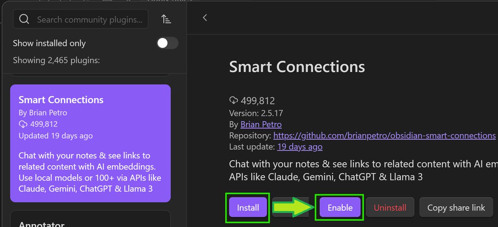
#### Install & Enable, That's It!
A [local model](https://www.perplexity.ai/search/what-are-local-ai-models-why-a-0TrSFXyaSZW3vOSpfQ8QHw) will immediately begin creating [AI embeddings](https://www.perplexity.ai/search/what-are-ai-embeddings-.MkBTzOISHiCj9MuYVqASw), no installing third-party software and no API key required!
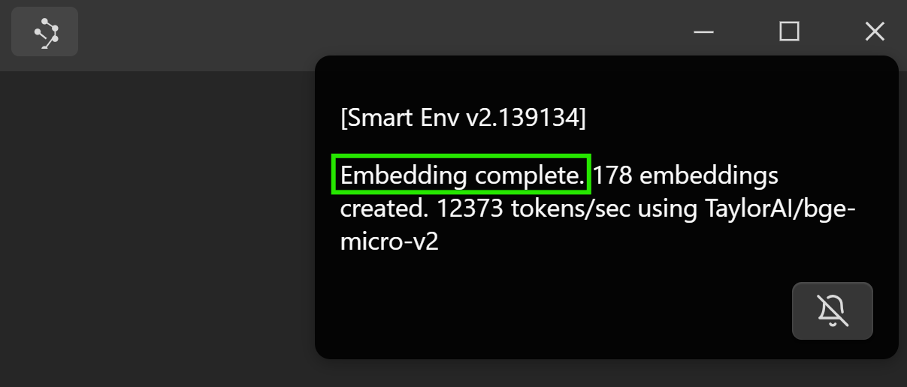
### Connections view
Use the Connections view to see relevant content based on the current note.

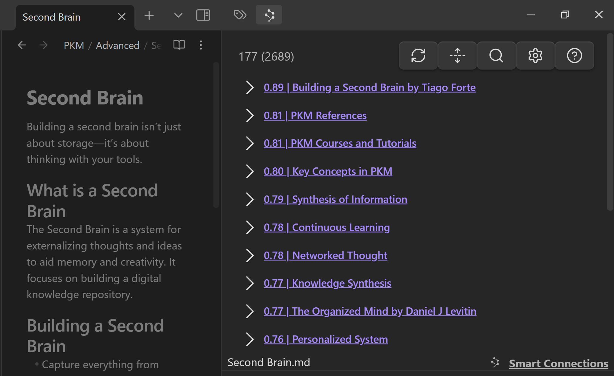
#### Opening the Connections view
Click the Connections view icon (<span style="color:lime;">circle</span>) or open the command palette to select one of the Connection view commands (<span style="color:lime;">rectangle</span>).

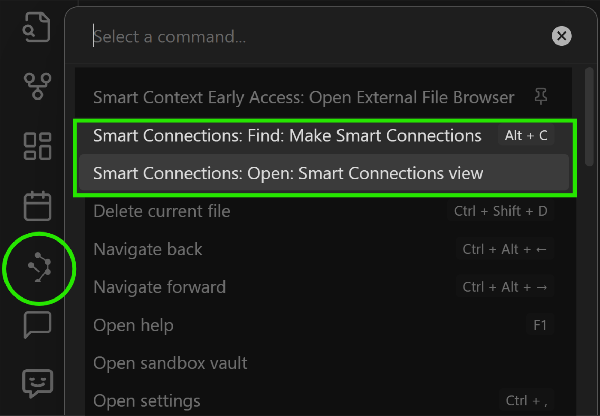

#### Using the Connections view
Connections view results update automatically when you change notes. The name of the <span style="color:lime;">current note</span> is located in the bottom-left of the Connections view. 

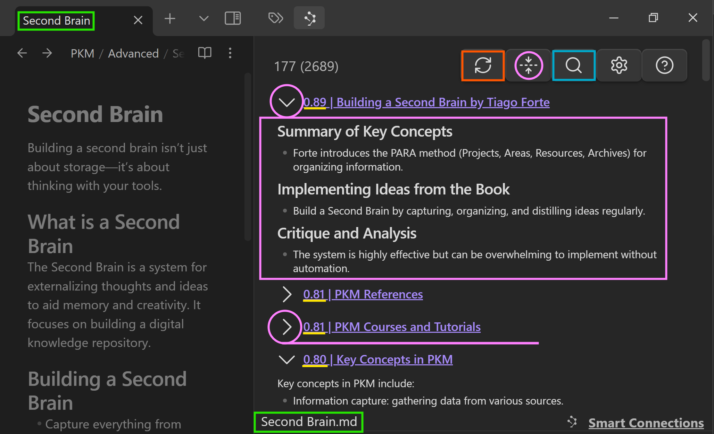
##### Result score (<span style="color: yellow;">underlined</span>)
The result score is based on the semantic similarity between the result and the current note. The value and range will change depending on the embedding model being used. 
##### Show/hide content (<span style="color:magenta;">expand or collapse</span>)
Results can be expanded or collapsed within the Connections view. The button in the row at the top can be used to expand/collapse all results.
##### Updating the results (<span style="color:orange;">refresh</span>)
Use the refresh button to update the embedding for the current active note and re-generate the connections results.
##### Lookup query (<span style="color:teal;">semantic search</span>)
Opens the Lookup pane to make a semantic query.
> [!NOTE]
> Semantic queries do not work like regular search queries. For example, a note containing the exact query may not be returned in the results.

#### Interacting with the Connections view
Creating links from the Connections view is as easy as dragging a result into an open note. Holding `⌘/ctrl` while hovering the mouse over a result will show the Obsidian native Hover Preview.


### Smart Chat
#### Opening the Smart Chat
Click the Chat view icon (<span style="color:lime;">circle</span>) or open the command palette to select the Chat view command (<span style="color:lime;">rectangle</span>).
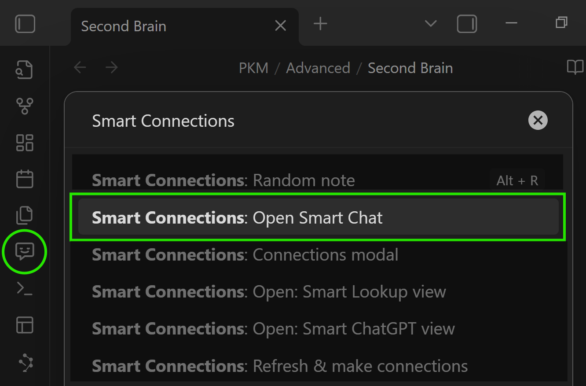

#### Using the Smart Chat
Smart Chat leverages context from your notes. Context can be added both manually and through AI guided semantic lookup.
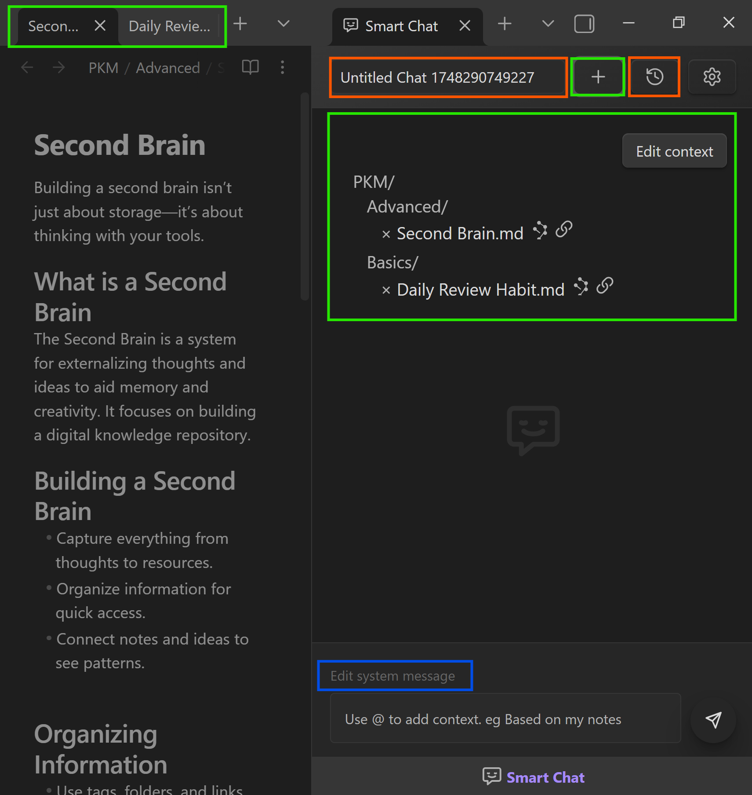
##### New chat (<span style="color: lime;">green squares</span>)
Open notes are automatically added to the chat context 
##### Chat history and conversation names (<span style="color:orange;">orange squares</span>)
Chats can be named directly in Smart Chat. Click the chat history icon to access past chats. 
##### System prompt (<span style="color:blue;">blue square</span>)
System prompts can be added alongside the user chat input and will be handled differently depending on the currently configured chat model.

#### Adding context to the Smart Chat
Open the <span style="color:teal;">context builder</span> by clicking the "Edit context" button and then select "Done" to insert the selected context into the conversation. 

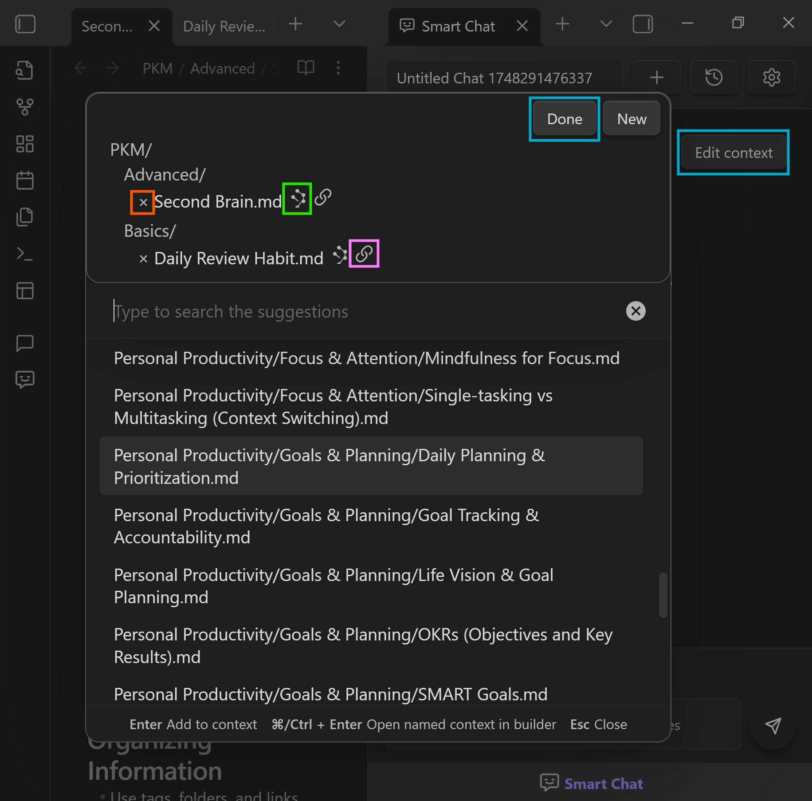
##### Show connections (<span style="color: lime;">connections icon</span>)
Click the connections icon next to any context item to show a list of connections that can be added as context.
##### Show links (<span style="color:magenta;">link icon</span>)
Click the link icon next to any context item to show a list of links that can be added as context.
##### Remove context (<span style="color:orange;">x</span>)
Individually remove context items by clicking the "x" button to the left of the item. Clicking the "New" button will remove all context items.
##### Trigger retrieval with self-referential pronouns
Use a self-referential pronoun to trigger note retrieval (<span style="color: lime;">lookup context action</span>) from within a conversation.

###### Review the retrieved context and send
Retrieved notes are displayed before the AI finishes responding. Context items may be added or removed before continuing. Click the "Send" button (<span style="color:teal;">blue square</span>) to complete the request based on the context.

The language setting determines which pronouns are detected to trigger the lookup. Both self-referential pronoun detection and reviewing context before completion are also configurable via the settings.

##### Drag files into the conversation to add as context
Include files in the chat using drag and drop.
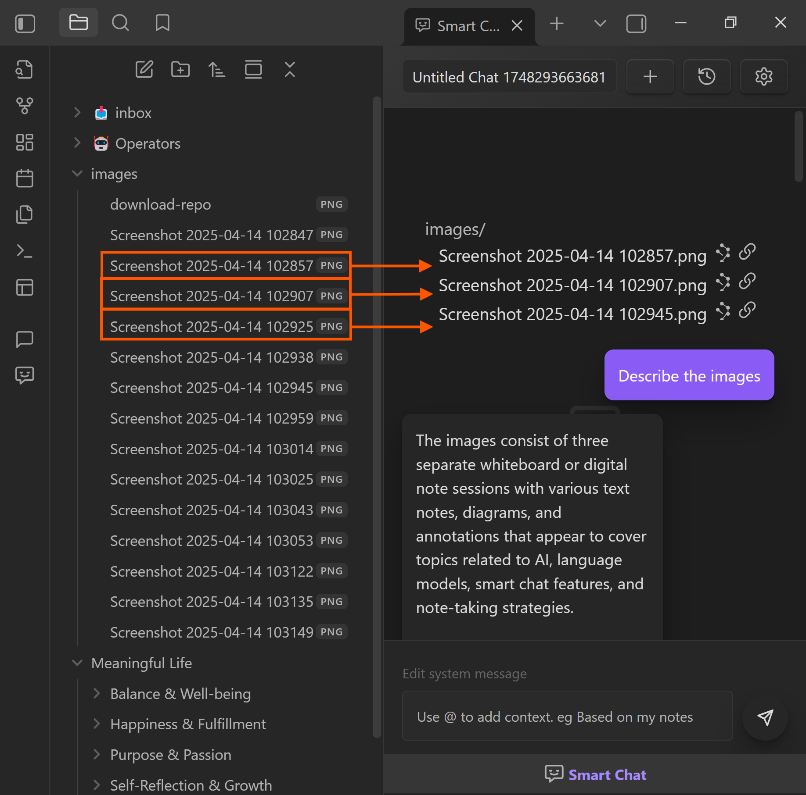


## Bases integration
Add the connections score based on a specified note to the bases table.
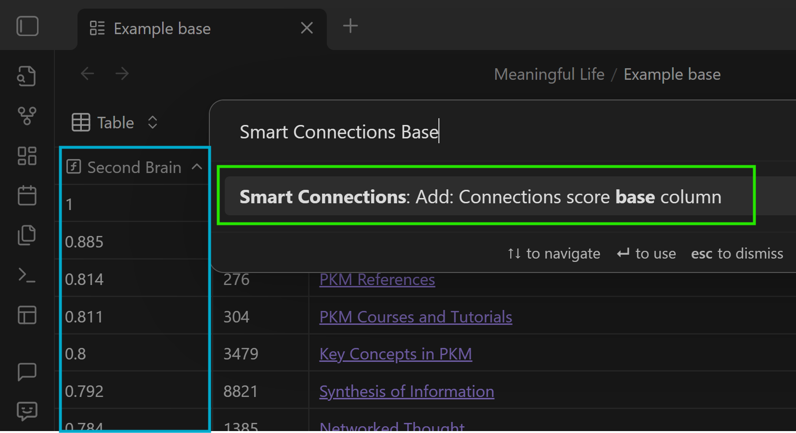
```yaml
formulas:
  🌴 My Smart LifeOS: cos_sim(file.file, "+Objective/🌴 My Smart LifeOS.md")
```
This adds a numeric similarity column comparing each row to `🌴 My Smart LifeOS.md`.
**Quick setup**
1. Open any `.base` file.
2. Run **Add: Connections score base column** from the command palette.
3. Choose the reference note ⇒ column is created (first position) and the table refreshes.

## Notifications & Settings
### Process Notifications
Gain insight into what's happening under-the-hood.

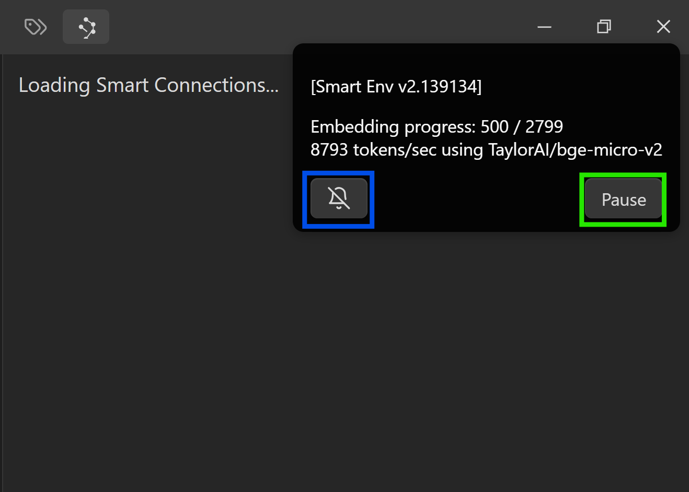
#### Pause embedding process (<span style="color:lime;">green</span>)
After clicking pause a new notification with a "Resume" button will appear.
#### Mute notification (<span style="color:cyan;">blue</span>)
Most notification are mutable. Notifications can be un-muted from the settings.
##### Muted notices in the settings
Muted notices will appear at the bottom of the Smart Connections settings. Use the "Remove" button to un-mute a notice. 
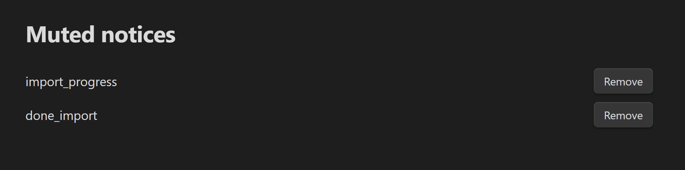

## Settings
#### Customizing the Connections view
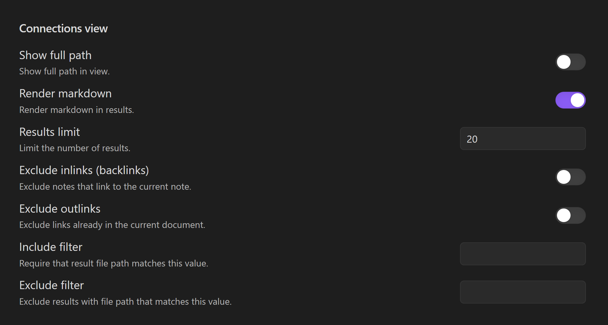
##### Show full path
Toggle this to show the full file path for each result in the Connections view. Helpful for disambiguating similarly named notes in different folders.
##### Render markdown
When enabled, renders markdown (e.g., bold, links, lists) directly in the preview of connection results, making context easier to interpret at a glance.
##### Results limit
Set a cap on how many connection results are shown per note. A smaller number can improve clarity and performance; a higher number surfaces more context.
##### Exclude inlinks (backlinks)
Hides notes that link *to* the current note. Useful if you want to see only AI-suggested relationships and ignore existing manual backlinks.
##### Exclude outlinks
Hides notes that the current note already links *out* to. Keeps your Connections view focused on new or unlinked associations.
##### Include filter
Restrict results to only those whose file path contains this value. Example: entering `projects/` will only show notes from the `projects` folder.
##### Exclude filter
Hides results with a file path containing this value. Example: entering `archive/` will hide archived notes from appearing in the Connections view.

#### Smart Chat settings
##### Chat interface
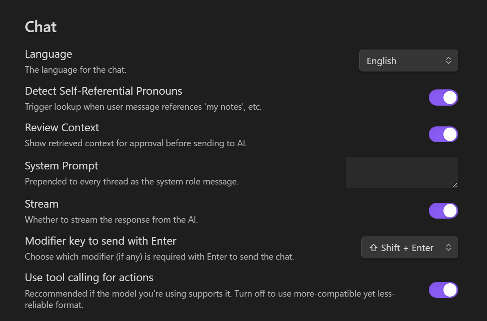
##### Model configuration
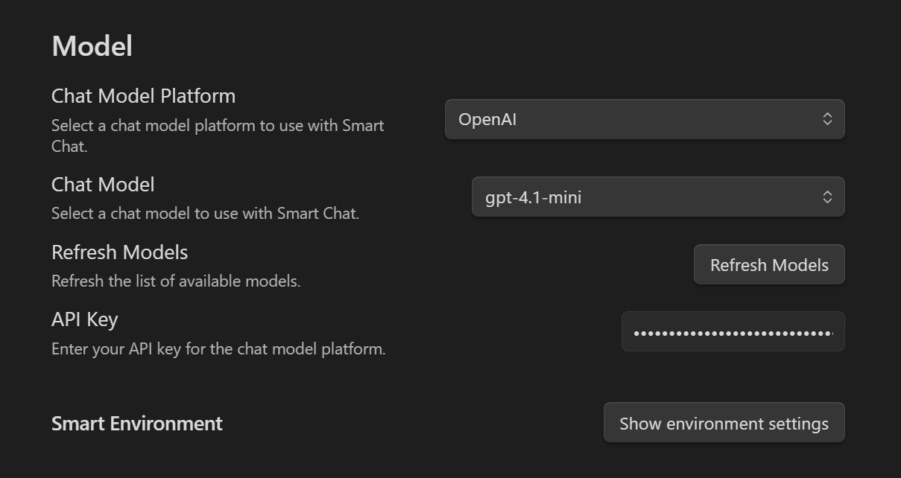
#### Smart Environment settings
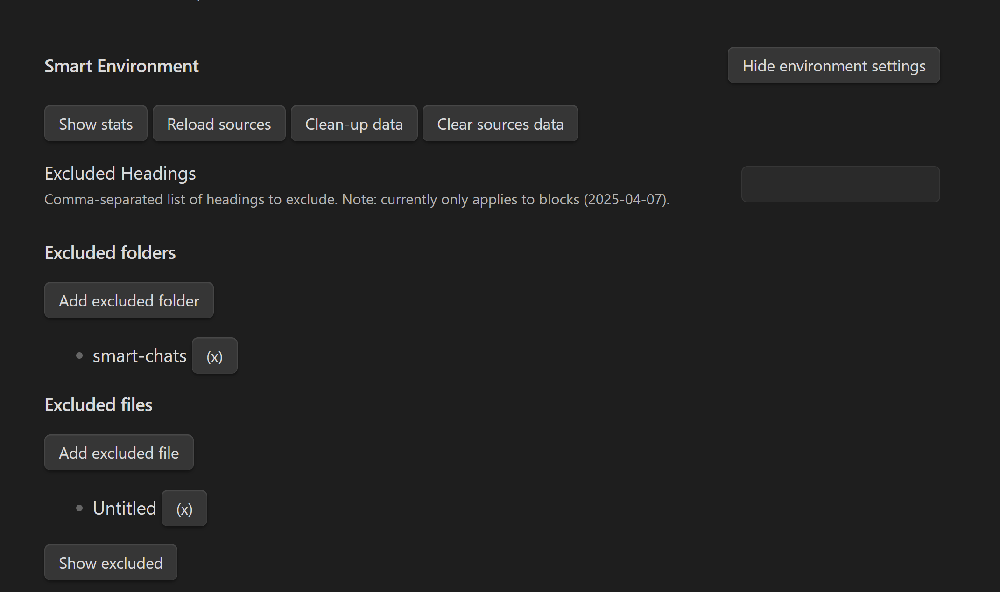
##### Action buttons
###### Show stats
Displays key metrics and diagnostic stats about your current Smart Environment (e.g. number of blocks, sources indexed, excluded items). Useful for debugging or performance tuning.
###### Reload sources
Reprocesses all sources in the environment, including notes, folders, and files. Handy after significant file changes or if context seems stale.
###### Clean-up data
Runs a safe cleanup process to remove orphaned or obsolete blocks and ensure metadata integrity. Does _not_ affect your source files.
###### Clear sources data
Wipes all Smart Environment data (sources, blocks, embeddings, metadata) without touching original files. Ideal when switching datasets or fixing corrupted states. *Does not delete settings.*
##### 📁 Excluded Folders
Lists folders that should be completely ignored by the Smart Environment. Any content in these folders won’t be indexed or included in prompts.
- Click **“Add excluded folder”** to select a folder.
- Click `(x)` to remove it from the exclusion list.
##### 📄 Excluded Files
Manually exclude individual files from being processed by Smart Context. Useful for private drafts or noisy files that distort context.
- Use **“Add excluded file”** to select files.
- Click `(x)` to remove a file from exclusion.
##### 🗂 Show Excluded
Opens a panel showing all currently excluded files and folders, giving you a full overview of what’s opted-out of the Smart Environment.

#### Sources and Blocks settings
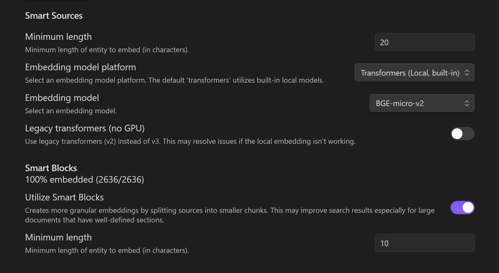
##### Smart Sources
###### Minimum length
Minimum number of characters an entity (e.g., paragraph, heading) must have to be embedded. Shorter entries are ignored to reduce noise.
###### Embedding model platform  
Choose where embeddings are generated.
- `Transformers (Local, built-in)` uses bundled models for full local processing.
- Other options may appear if remote APIs or custom models are integrated.
###### Embedding model  
Choose which model to use for generating embeddings.  
Example: `BGE-micro-v2` is lightweight and fast, suitable for small-to-medium vaults.
###### Legacy transformers (no GPU)  
Enables v2 transformer logic, which may be more compatible on systems without GPU acceleration. Toggle this if local embeddings fail to load or crash.
##### Smart Blocks
###### 100% embedded (2636/2636)  
Displays the current embedding coverage: how many content blocks have been processed.
###### Utilize Smart Blocks  
When enabled, large documents are split into fine-grained blocks (based on headings and structure), improving semantic search and context relevance.
###### Minimum length (for blocks)  
Sets the minimum character length for a block to be embedded. Avoids generating embeddings for very short or irrelevant sections.
## Built for You

> [!NOTE] Smart Connections changed my life
> Smart Connections started as a personal tool, like many others I built before it. But, this time was different.
> 
> This time, the Obsidian community became a part of the process. From the beginning, Smart Connections users empowered me to realize the potential of user-aligned tools for thought. 
> 
> The earliest adopters, like Sarah, gave me critical feedback that improved the software and provided financial support that enabled me to focus on the project full-time. 
> 
> Matthew joined the community and started our Community Lean Coffee meetings, which have become an invaluable resource and introduced me to many more people that have given their time and resources to support my work.
> 
> This experience made me realize how we can work together to empower each other with new ideas and user-aligned tools to thrive with AI.
> 
> Smart Connections helped me realize my core-value & purpose of empowerment. It empowered me to make the connection of synergy between my love for building and empowering ordinary people to achieve extraordinary results.

### It's not about features, it's about empowerment
I build tools that empower you (me) to bring your (my) ideas to reality. 

### Built from scratch
Building the Smart Environment, the core architecture behind Smart Connections, from scratch has empowered me with a deep understanding of the capabilities and limitations of AI. These insights are why I believe the Smart Ecosystem will outlast me.

### Stronger together
Smart Connections represents a threat to profit-driven enterprises that benefit from powerless individuals. User-aligned software means leveraging efficiencies that are out-of-reach for major corporations. I hope my journey inspires you to break-free from the belief that you are limited and that others are in control.

### Come for the tools, stay for the community
Smart Connections users come for the tools, but they stay for the mission-driven community and our shared vision of empowering ourselves with Smart Tools and Workflows. Together, we are on a journey of exploration and empowerment!

## Smart Ecosystem
As luck has it, I began jotting down lines of code for automations in my school notebooks. This grew into a skill for designing complex systems.

### Smart Plugins
I build Smart Plugins, like Smart Connections, to empower myself to explore new concepts, design better tools, and handle more complexity in my Obsidian. My goal is to make as many of these concepts and tools available to you.

### Smart Business Model
The reality is that most valuable tools cannot exist without financial support. But that doesn't mean having to sell-out or shutdown. Obsidian has shown us that valuable software can be user-funded, and I believe now is a better time than ever to bring the vision of user-aligned software to reality.
#### Principle: Build local tools to maximize empowerment
Software that runs locally can empower unlimited users with zero-marginal cost. 
#### Principle: User-supported means user-aligned
Early & experimental features are provided to supporters. This means more-reliable software with a valuable feedback loop from users invested in making the project better.

### Official Smart Plugins
- Smart Chat
- Smart Context
- Smart Editor
### Community Smart Plugins
These plugins are built and maintained by Smart Community members.

- [Smart Connections Visualizer](https://obsidian.md/plugins?id=smart-connections-visualizer)
	- Graph-view for connections to your current note.
- [Smart Vault Visualizer](https://obsidian.md/plugins?id=smart-vault-visualizer)
	- Graph-view for visualizing clusters across the entire vault.

  


## User Testimonials
Hearing from those who use Smart Connections brings to life the impact it has on individuals' workflows and creativity. 

Here's what some of them have to say:

- "Smart Connections is revolutionary for my process of attempting to wrangle decades of sprawling unorganized notes, journals etc. Amazing work! Look forward to seeing it evolve." - Ronny
- ["I've switched over from Mem to Obsidian when I found this plugin"](https://discord.com/channels/686053708261228577/694233507500916796/1091164112425320538)
- ["I actually decided to start using Obsidian BECAUSE of Smart Connections."](https://github.com/brianpetro/obsidian-smart-connections/issues/441#:~:text=I%20actually%20decided%20to%20start%20using%20Obsidian%20BECAUSE%20of%20Smart%20Connections.)
- [Let me take the opportunity to say what a brilliant plug in you have created it has completely transformed the way I am able to use notes.](https://github.com/brianpetro/obsidian-smart-connections/issues/592#issuecomment-2104332746:~:text=Let%20me%20take%20the%20opportunity%20to%20say%20what%20a%20brilliant%20plug%20in%20you%20have%20created%20it%20has%20completely%20transformed%20the%20way%20I%20am%20able%20to%20use%20notes)
- [I can already see this will be a game-changer for my research and personal note-taking.](https://github.com/brianpetro/obsidian-smart-connections/issues/589#issuecomment-2104948387:~:text=I%20can%20already%20see%20this%20will%20be%20a%20game%2Dchanger%20for%20my%20research%20and%20personal%20note%2Dtaking.)
- [Hi Brian, you've created one of the most powerful Obsidian's plugin, in the name of all the Obsidian users, i really want to thank you ! It makes our lives easier and more creative ❤️](https://www.youtube.com/watch?v=tGZ6J63UZmw&lc=UgwRE_J-yZ5QVC6b6yJ4AaABAg)
- [thanks so much for this and the wonderful plugin.](https://www.youtube.com/watch?v=tGZ6J63UZmw&lc=UgzgQhv2CA0easzk7np4AaABAg)
- ["This is such a game-changingly helpful plugin"](https://github.com/brianpetro/obsidian-smart-connections/issues/329#issuecomment-2002162224:~:text=This%20is%20such%20a%20game%2Dchangingly%20helpful%20plugin)
- ["This plugin has become a vital part of my life"](https://github.com/brianpetro/obsidian-smart-connections/issues/120#issuecomment-1492842117:~:text=This%20plugin%20has%20become%20a%20vital%20part%20of%20my%20life)
- ["This is by far my favourite Obsidian plug-in and it is immensely helpful. I'll be doing a full video about using it for PhD research"](https://github.com/brianpetro/obsidian-smart-connections/discussions/371#discussioncomment-7977910:~:text=This%20is%20by%20far%20my%20favourite%20Obsidian%20plug%2Din%20and%20it%20is%20immensely%20helpful.%20I%27ll%20be%20doing%20a%20full%20video%20about%20using%20it%20for%20PhD%20research)
- ["It's astonishing the power it provides to deal with scientific research and scientific articles included in the vault."](https://github.com/brianpetro/obsidian-smart-connections/issues/250#issuecomment-1595108987:~:text=It%27s%20astonishing%20the%20power%20it%20provids%20to%20deal%20with%20scientific%20research%20and%20scientific%20articles%20included%20in%20the%20vault.)
- ["Smart Connections is easily in my Top 3 [plugins], it changes radically the use of [Obsidian], many thanks for that."](https://github.com/brianpetro/obsidian-smart-connections/issues/64#issuecomment-1484212168:~:text=Smart%20connections%20is%20easily%20in%20my%20Top%203%2C%20it%20changes%20radically%20the%20use%20of%20the%20Soft%2C%20many%20thanks%20for%20that.)
- ["[Smart Connections] significantly changed how I use PKM"](https://discord.com/channels/686053708261228577/710585052769157141/1091163849190801468)
- ["This is an AWESOME little plugin. Thanks for sharing."](https://forum.obsidian.md/t/introducing-smart-chat-a-game-changer-for-your-obsidian-notes-smart-connections-plugin/56391/8?u=wfh#:~:text=This%20is%20an%20AWESOME%20little%20plugin.%20Thanks%20for%20sharing.)
- ["Hopping on to also say thanks. I have been wanting this feature in something ever since reading about tad starners remembrance agent in the 90s! And this is even better."](https://github.com/brianpetro/obsidian-smart-connections/issues/47#issuecomment-1471441869:~:text=Hopping%20on%20to%20also%20say%20thanks.%20I%20have%20been%20wanting%20this%20feature%20in%20something%20ever%20since%20reading%20about%20tad%20starners%20remembrance%20agent%20in%20the%2090s!%20And%20this%20is%20even%20better.)
- ["I'm having so much fun using your chat plugin to search my notes better and get insights."](https://github.com/brianpetro/obsidian-smart-connections/issues/57#:~:text=Hi%2C-,I%27m%20having%20so%20much%20fun%20using%20your%20chat%20plugin%20to%20search%20my%20notes%20better%20and%20get%20insights,-.%20I%20was%20just)
- ["This is undoubtedly an excellent plugin that makes a significant improvement in how we interact with our notes."](https://github.com/brianpetro/obsidian-smart-connections/pull/219#issuecomment-1562572364:~:text=This%20is%20undoubtedly%20an%20excellent%20plugin%20that%20makes%20a%20significant%20improvement%20in%20how%20we%20interact%20with%20our%20notes.)
- "I have been using Smart Connections with Obsidian. It is excellent. I am finding more and more uses for it. I am intrigued by the idea of being able to use a local embedding model." - Eamonn
- "Huge fan of Smart Connections so much that I even [wrote a post about how I use it to massively save time on summarizing legal cases](https://careylening.substack.com/p/the-power-of-links-and-second-brains-d1d) (I also talk about my whole crazy workflow and the other tools I use, but SC gets a big shout-out)" - Carey
- "I love the latest version of Smart Connections and just used it for an amazing use case: I took my Obsidian notes and used them for qualifying my yearly performance review." - Jarrett
- "Thanks for your incredible work - I am a performer and a sound artist and your plugin is really helping me make the most of Obsidian, make all kinds of fruitful connections." - Adrienne
- "I'm currently writing a book and this is proving helpful in the process." - Michael
- "Love the plugin! use it all the time. I'm also doing a webinar about it for my community." - Alex
- "I use your app every day. I am a product manager and have a knowledge base of products that I reference in my writing and user story creation."  - Todd
- "On a personal note, man do I wish I had access to these kinds of things when I was doing my PhD." - Mikey

<details><summary>More nice things about Smart Connections 😊</summary>


- "Smart Connections is truly the best new plugin of the year. Please keep it up!" - Larry
- "Brian, you've done a great job. Smart Connections is the best Obsidian plugin ever." - Es
- "I really do love the app.  It saved me from having to buy Mems and stick with Obsidian." - Greg
- "Thanks for making Smart Connections. I use it every day and it has completely changed the game." - Joe
- "I am glad to see your updates on smart connections in the new year. Thank you for your selfless contribution." - 嘿然笑道 
- "Love this app! V2 looks to have an awesome feature as well. Keep up the great work." - Austin
- "I wanted to show my support for Smart Connections and would love to not only get early access to Version 2.0, but help out wherever I can. Thanks!!" - Danny
- "Great plugin, use it as my standard right pane." - Guenter
- "I believe it one of the best plugin for Obsidian!" - Viktor
- "Thank you for the great plugin. I definitely had to vote for it :)" - Marc
- "Good luck and great work on the plugin so far!" - Harpreet
- "Thank you again for your amazing plugin." - Eduardo 
- "Hey, thanks for a great app." - Robert
- "Smart Connections is a really great program, and I am looking forward to working with v2.0." - Jarrett
- "Keep up the great work ♡" - Duke
- "Such an amazing plug-in. Thanks for supercharging my notes!" - Simon
- "Thank you for the plugin! It looks very promising, I am still exploring it." - Damien
- "Big thanks to you for creating such a slick tool. Excited to see where it goes!" - Khael
- "Thank you for this amazing tool!" - Pablo
- "Keep up the good work :-)" - Dorian
- "Thanks for your work on Smart Connections. Excited for v2" - Eli
- "Absolutely love what you're doing here and I can't wait to see how this plugin continues to grow over the next year!" - Ryan
- "You're crushing it!" - Chad
- "Way to go, Brian. Smart Connections Rocks!"  - Arne
- "Tks a lot for the effort you put in this tool!" - Marcelo
- "Thanks for a great plug-in BTW." - Ali
- "Thanks for the plugin ! It really helps in my work :)" - Jordan
- "I am just discovering it, but enjoying it so far!"  - Nick
- "Thank you for all your work on Smart Connections." - Ed
- "In my top 3 of the most useful plugins." - Mickaël 
- "Thank you for your hard work. - from South Korea" - 오송인
- ["I love this extension so much. So many potential features by the way."](https://github.com/brianpetro/obsidian-smart-connections/issues/48#issuecomment-1459929611:~:text=I%20love%20this%20extension%0Aso%20much.%20So%20many%20potential%20features%20by%20the%20way.)
- ["This plugin is fantastic"](https://github.com/brianpetro/obsidian-smart-connections/issues/47#:~:text=This%20plugin%20is%20fantastic)
- ["This is a terrific idea"](https://github.com/brianpetro/obsidian-smart-connections/issues/54#:~:text=This%20is%20a%20terrific%20idea)
- ["This plugins could be a Game changer!"](https://github.com/brianpetro/obsidian-smart-connections/issues/54#:~:text=This%20plugins%20could%20be%20a%20Game%20changer!)
- ["I personally love the app"](https://old.reddit.com/r/ObsidianMD/comments/11s0oxb/chat_with_your_notes_now_available_in_the_smart/jcd73y8/?context=3#:~:text=I%20personally%20love%20the%20app)
- ["This app is such a game changer"](https://github.com/brianpetro/obsidian-smart-connections/discussions/203#discussioncomment-5854265:~:text=This%20app%20is%20such%20a%20game%20changer.)
- ["Absolutely LOVE this plugin"](https://github.com/brianpetro/obsidian-smart-connections/issues/202#issue-1702708828:~:text=Absolutely%20LOVE%20this%20plugin.)
- ["Smart-connections is a fantastic plugin"](https://github.com/brianpetro/obsidian-smart-connections/issues/280#issuecomment-1630047763:~:text=Smart%2Dconnections%20is%20a%20fantastic%20plugin)
- ["Hi, amazing plugin! 🔥"](https://github.com/brianpetro/obsidian-smart-connections/issues/57#issuecomment-1488187361:~:text=Hi%2C%20amazing%20plugin,%F0%9F%94%A5)
- ["Absolutely mind blowing"](https://twitter.com/micka_dore/status/1641527570867822615?s=20)
- ["I love this plugin"](https://github.com/brianpetro/obsidian-smart-connections/issues/496#issuecomment-1996755512:~:text=interest%20of%20course.-,I%20love%20this%20plugin,-.)
- ["Now it serves me as a way to brainstorm potential connections, and I have seen major improvements over the past few months. I especially enjoy using it as part of my book digestion and relation process."](https://old.reddit.com/r/ObsidianMD/comments/11s0oxb/chat_with_your_notes_now_available_in_the_smart/jcczwiq/?context=3#:~:text=Now%20it%20serves%20me%20as%20a%20way%20to%20brainstorm%20potential%20connections%2C%20and%20I%20have%20seen%20major%20improvements%20over%20the%20past%20few%20months.%20I%20especially%20enjoy%20using%20it%20as%20part%20of%20my%20book%20digestion%20and%20relation%20process.)
- ["this is just such an incredible plugin!"](https://github.com/brianpetro/obsidian-smart-connections/issues/244#issuecomment-1595765101:~:text=this%20is%20just%20such%20an%20incredible%20plugin)
- ["Tried it, and it worked as well as I could hope! Thanks for making this."](https://old.reddit.com/r/ObsidianMD/comments/11s0oxb/chat_with_your_notes_now_available_in_the_smart/jcdpwsg/?context=3#:~:text=Tried%20it%2C%20and%20it%20worked%20as%20well%20as%20I%20could%20hope!%20Thanks%20for%20making%20this.)
- ["This is an amazing extension."](https://github.com/brianpetro/obsidian-smart-connections/issues/32#issuecomment-1435798970:~:text=This%20is%20an%20amazing%20extension.)
- [This is really cool...](https://twitter.com/rcvd_io/status/1638271532932780035?s=20)
- ["This is an amazing plugin!"](https://github.com/brianpetro/obsidian-smart-connections/issues/20#:~:text=This%20is%20an%20amazing%20plugin!)
- ["With smart connections, by just opening one such note, I can find all the others that reference the concept"](https://discord.com/channels/686053708261228577/694233507500916796/1091167414865109012)
- ["Has amazing potential to unlock lots of new info that can be added to your vault"](https://github.com/brianpetro/obsidian-smart-connections/issues/19#issue-1533699525:~:text=has%20amazing%20potential%20to%20unlock%20lots%20of%20new%20info%20that%20can%20be%20added%20to%20your%20vault)
- ["Great plugin!"](https://github.com/brianpetro/obsidian-smart-connections/issues/1#issue-1511238131:~:text=Dec%2026%2C%202022-,Great%20plugin!,-My%20request%20is)
- ["Loving the plugin so far!"](https://github.com/brianpetro/obsidian-smart-connections/issues/2#issue-1511288845:~:text=Loving%20the%20plugin%20so%20far!)
- ["Smart Connections is so cool. I'm noticing similarities between notes that talk about the same thing but don't share any words."](https://discord.com/channels/686053708261228577/694233507500916796/1065057689949982870#:~:text=Smart%20Connections%20plugin%3F%20It%27s%20so%20cool.%20I%27m%20noticing%20similarities%20between%20notes%20that%20talk%20about%20the%20same%20thing%20but%20don%27t%20share%20any%20words.)
- ["Thanks for doing this. I love the idea to have OpenAI help look through my notes to find connections"](https://github.com/brianpetro/obsidian-smart-connections/issues/47#issue-1609765217:~:text=Thanks%20for%20doing%20this.%20I%20love%20the%20idea%20to%20have%20OpenAI%20help%20look%20through%20my%20notes%20to%20find%20connections.)
</details>

[Even more love for Smart Connections 🥰](https://smartconnections.app/smart-connections-love/)
