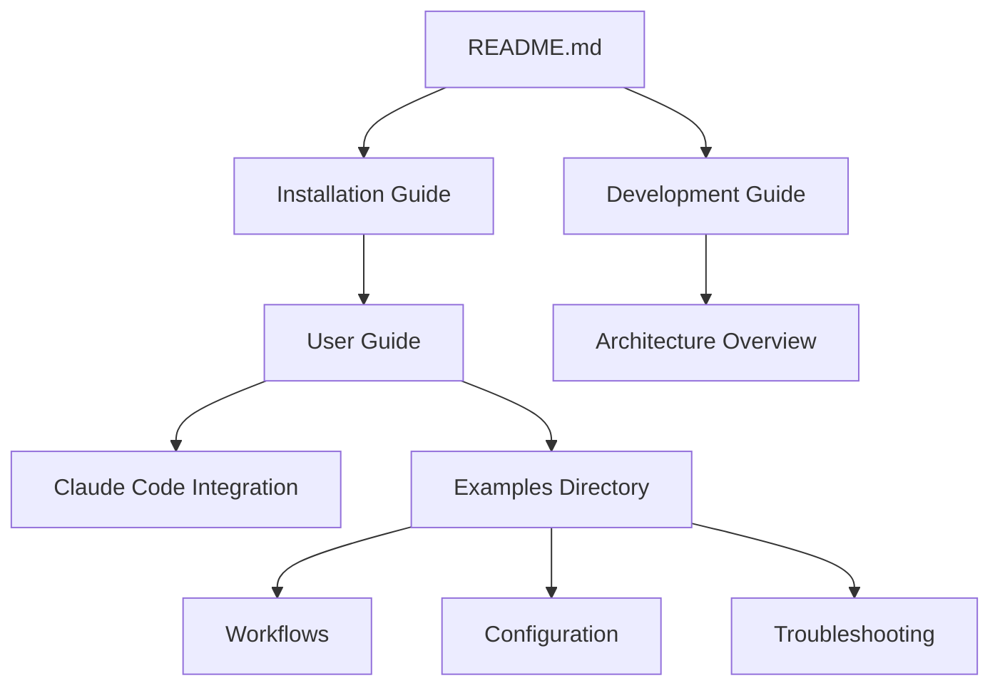

# Documentation Style Guide & Maintenance

> **Guidelines for maintaining consistent, high-quality documentation**

## Documentation Structure

```
docs/
├── README.md                    # Documentation hub
├── DOCUMENTATION-GUIDE.md       # This file - style guide
├── ARCHITECTURE-EXPLAINED.md    # User-friendly architecture overview
├── installation.md              # Installation guide
├── user-guide.md               # User manual
├── development.md              # Developer documentation
├── architecture.md             # Technical architecture
├── claude-code-integration.md  # Claude CLI setup and usage
├── claude-code-migration.md    # Migration from APIs
└── examples/                   # Practical examples
    ├── installation-walkthrough.md
    ├── common-workflows.md
    └── configuration-examples.md
```

## Consistent Terminology

### Always Use These Terms

| Concept | Correct Term | Avoid |
|---------|-------------|--------|
| **Plugin** | Smart Connections | smart-connections, SC |
| **CLI** | Claude Code CLI | claude cli, Claude CLI |
| **Search** | Semantic search | vector search, similarity search |
| **Chat** | Smart Chat | chat view, AI chat |
| **Notes** | Notes or vault | documents, files |
| **Config** | Configuration or settings | config, prefs |
| **Folder** | Folder | directory (except in technical contexts) |

### Feature Names

- **Smart Connections** - The semantic search feature
- **Smart Chat** - The AI conversation feature
- **Smart Sources** - The file embedding collection
- **Smart Blocks** - Block-level embeddings
- **SmartEnv** - The core environment framework

## Cross-Reference Map

### Primary Documentation Flow



### Link Standards

#### Internal Links Within docs/
```markdown
# Relative paths for same directory
[User Guide](./user-guide.md)

# Parent directory reference
[Back to Docs](../README.md)

# Subdirectory reference
[Installation Example](./examples/installation-walkthrough.md)
```

#### Section Links
```markdown
# Link to specific section
[Troubleshooting](./user-guide.md#troubleshooting)

# Link to anchor in same file
[See Configuration](#configuration)
```

#### External Links
```markdown
# Always use full URLs for external
[Obsidian](https://obsidian.md)

# GitHub links use full URL
[Issues](https://github.com/yourusername/obsidian-smart-connections/issues)
```

## Navigation Elements

### Required Navigation

Every documentation file MUST have:

#### Header Navigation
```markdown
[← Back to Documentation](./README.md) | [Home](../README.md)
```

#### Footer Navigation
```markdown
---

[← Previous Section](./previous.md) | [Next Section →](./next.md)
```

### Navigation Order

1. Installation → User Guide → Claude Integration
2. Development → Architecture
3. Examples flow: Installation → Workflows → Configuration

## Formatting Standards

### Headers

```markdown
# Main Title (One per document)

## Major Sections

### Subsections

#### Minor Points
```

### Code Blocks

Always specify language:
```javascript
// JavaScript example
const example = true;
```

```bash
# Shell commands
npm install
```

```markdown
# Markdown examples
**Bold** and *italic*
```

### Tables

```markdown
| Column 1 | Column 2 | Column 3 |
|----------|----------|----------|
| Data     | Data     | Data     |
```

### Callouts (Obsidian)

```markdown
> [!INFO] Information
> General information

> [!TIP] Tip
> Helpful suggestions

> [!WARNING] Warning
> Important cautions

> [!SUCCESS] Success
> Positive outcomes
```

## Metadata Headers

### Required Frontmatter (for Obsidian notes)

```yaml
---
title: "Document Title"
description: "Brief description"
tags: [documentation, smart-connections]
created: 2025-08-26
updated: 2025-08-26
---
```

### Optional Frontmatter

```yaml
aliases: 
  - Alternative Name
  - Short Name
author: Your Name
version: 1.0.0
```

## Documentation Maintenance

### Update Checklist

When updating documentation:

- [ ] Update `updated` date in frontmatter
- [ ] Check all internal links still work
- [ ] Verify code examples are current
- [ ] Update version numbers if applicable
- [ ] Check terminology consistency
- [ ] Update navigation if structure changed
- [ ] Update cross-reference map if needed

### Version Control

```markdown
# In frontmatter
version: 1.0.0  # Major.Minor.Patch

# In footer
*Last updated: 2025-08-26 | Version: 1.0.0*
```

### Testing Documentation

#### Link Testing
```bash
# Check for broken internal links
grep -r "\[.*\](" docs/ | grep -v "http" | sort -u

# Find orphaned files (no incoming links)
for file in docs/*.md; do
  basename=$(basename $file)
  count=$(grep -r "$basename" docs/ | grep -v "^$file:" | wc -l)
  if [ $count -eq 0 ]; then
    echo "Orphaned: $file"
  fi
done
```

#### Consistency Checking
```bash
# Check for inconsistent terminology
grep -ri "smart-connections" docs/  # Should use "Smart Connections"
grep -ri "claude cli" docs/  # Should use "Claude Code CLI"
```

## Content Guidelines

### Writing Style

- **Be Clear**: Use simple, direct language
- **Be Specific**: Avoid vague terms
- **Be Consistent**: Use the same terms throughout
- **Be Helpful**: Anticipate user questions

### Examples

Always include:
- ✅ Working examples users can copy
- ✅ Common scenarios
- ✅ Expected output
- ✅ Troubleshooting tips

### Visual Aids

Use when helpful:
- Mermaid diagrams for flows
- Tables for comparisons
- Code blocks for examples
- Callouts for important info

## Quick Reference

### File Naming

```
lowercase-with-hyphens.md  ✅
UPPERCASE-FOR-EMPHASIS.md  ✅ (sparingly)
avoid_underscores.md       ❌
noSpaces.md               ❌
```

### Link Checklist

- [ ] All internal links use relative paths
- [ ] Section anchors are lowercase with hyphens
- [ ] External links open in new tab (for web)
- [ ] No broken links
- [ ] Bidirectional navigation

### Common Patterns

#### API Documentation
```markdown
### `functionName(parameters)`

**Description**: What it does

**Parameters**:
- `param1` (Type): Description
- `param2` (Type): Description

**Returns**: Type - Description

**Example**:
```javascript
const result = functionName(arg1, arg2);
```
```

#### Configuration Documentation
```javascript
{
  "setting": "value",  // Description
  "option": true      // Explanation
}
```

## Maintenance Schedule

### Regular Updates

- **Weekly**: Check for broken links
- **Monthly**: Review terminology consistency
- **Quarterly**: Major documentation review
- **Annually**: Complete overhaul assessment

### Automation

Consider automating:
- Link checking
- Terminology validation
- Version updates
- Table of contents generation

---

*Documentation Guide Version: 1.0.0 | Last Updated: 2025-08-26*