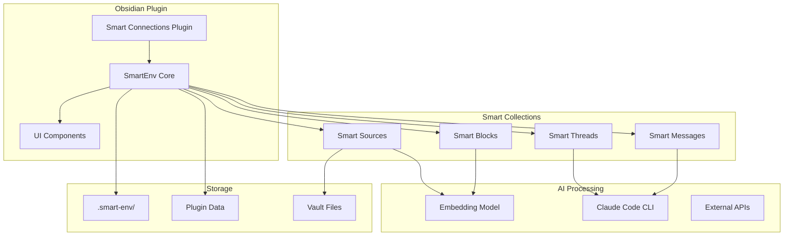
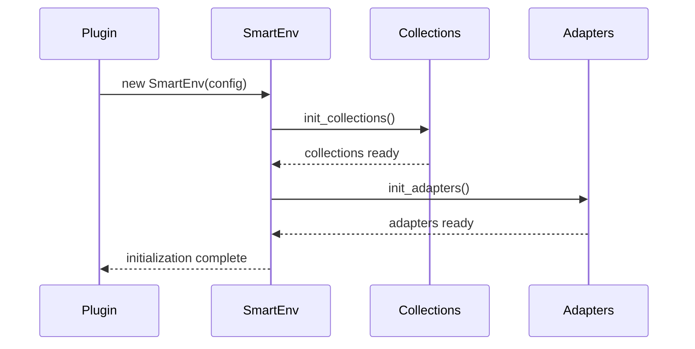
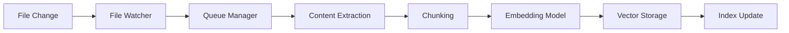
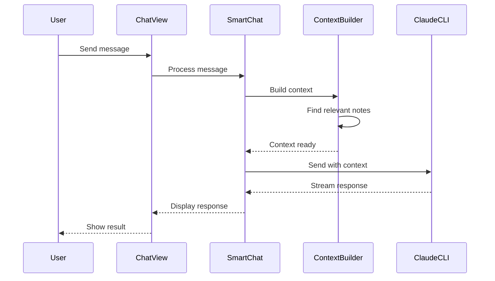
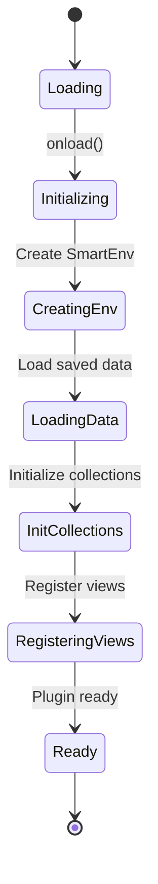
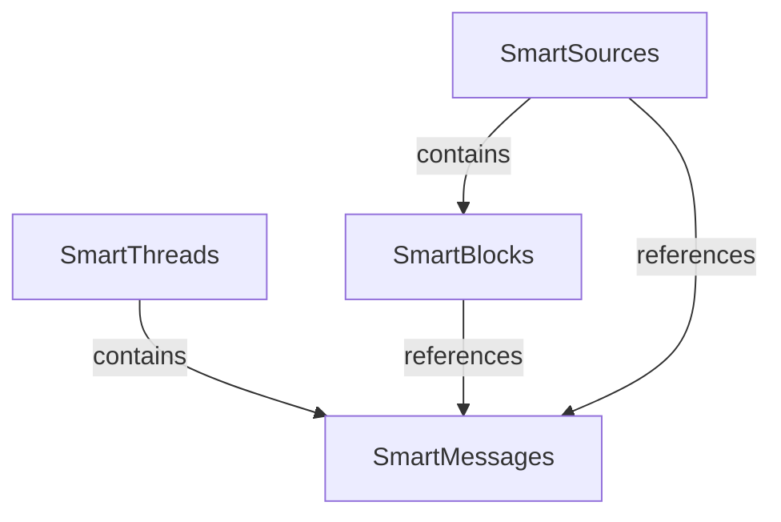

# Architecture Overview

> **Technical deep dive into the Enhanced Smart Connections architecture**

## Table of Contents

1. [System Architecture](#system-architecture)
2. [Core Components](#core-components)
3. [SmartEnv Framework](#smartenv-framework)
4. [Data Flow](#data-flow)
5. [Claude Code Integration](#claude-code-integration)
6. [Plugin Lifecycle](#plugin-lifecycle)
7. [Collection System](#collection-system)
8. [Embedding Pipeline](#embedding-pipeline)
9. [Storage Architecture](#storage-architecture)
10. [Security Model](#security-model)

## System Architecture

### High-Level Overview



### Component Layers

| Layer | Components | Responsibility |
|-------|------------|----------------|
| **Presentation** | Views, Modals, Components | User interface and interaction |
| **Application** | SmartEnv, Controllers | Business logic and coordination |
| **Domain** | Collections, Models | Core domain logic and entities |
| **Infrastructure** | Adapters, Storage | External integrations and persistence |

## Core Components

### Main Plugin Class

```javascript
// src/index.js
export default class SmartConnectionsPlugin extends Plugin {
  async onload() {
    // Initialize SmartEnv
    await this.initialize();
    
    // Register views
    this.registerView(VIEW_TYPE_CONNECTIONS, ...);
    this.registerView(VIEW_TYPE_CHAT, ...);
    
    // Set up commands
    this.addCommand({...});
    
    // Configure ribbon icons
    this.addRibbonIcon(...);
  }
  
  async initialize() {
    // Create SmartEnv instance
    this.env = new SmartEnv(this, this.get_env_config());
    await this.env.init();
  }
}
```

### SmartEnv Core

The SmartEnv class is the central coordination point:

```javascript
class SmartEnv {
  constructor(plugin, config) {
    this.plugin = plugin;
    this.config = config;
    this.collections = {};
    this.adapters = {};
  }
  
  async init() {
    // Initialize collections
    await this.init_collections();
    
    // Set up adapters
    await this.init_adapters();
    
    // Start processing
    await this.process_queue();
  }
}
```

### Configuration Hierarchy

```javascript
// Configuration merge order (highest to lowest priority):
1. Plugin instance config
2. src/smart_env.config.js  // Plugin-specific
3. smart_env.config.js       // Root config
4. External package configs  // Dependencies
5. Default values           // Fallbacks
```

## SmartEnv Framework

### Environment Initialization



### Collection Registration

```javascript
// Collections are registered in config
{
  collections: {
    smart_sources: {
      class: SmartSources,
      data_path: '.smart-env/sources.json'
    },
    smart_blocks: {
      class: SmartBlocks,
      data_path: '.smart-env/blocks.json'
    },
    smart_threads: {
      class: SmartThreads,
      data_path: 'smart_threads.json'
    }
  }
}
```

### Adapter Pattern

Adapters bridge generic functionality to platform-specific implementations:

```javascript
// Platform adapters
class SmartFsObsidianAdapter {
  async read(path) {
    return await this.app.vault.read(path);
  }
}

// Provider adapters
class ClaudeCodeCLIAdapter {
  async complete(messages, options) {
    // Claude-specific implementation
  }
}
```

## Data Flow

### Embedding Generation Flow



### Chat Interaction Flow



### Connection Search Flow

```javascript
// Simplified flow
async findConnections(currentNote) {
  // 1. Get current note embedding
  const embedding = await this.getEmbedding(currentNote);
  
  // 2. Calculate similarities
  const similarities = await this.calculateSimilarities(embedding);
  
  // 3. Filter and rank
  const filtered = this.applyFilters(similarities);
  const ranked = this.rankBySimilarity(filtered);
  
  // 4. Return top results
  return ranked.slice(0, this.config.max_results);
}
```

## Claude Code Integration

### Adapter Architecture

```javascript
class ClaudeCodeCLIAdapter extends SmartChatModelAdapter {
  constructor(env) {
    super(env);
    this.name = 'Claude Code CLI';
    this.type = 'local';
    this.process = null;
  }
  
  async isAvailable() {
    // Check if Claude CLI is installed
    return await this.checkCliInstalled();
  }
  
  async complete(messages, options) {
    // Build context from vault
    const context = await this.buildContext(messages);
    
    // Prepare prompt with context
    const prompt = this.formatPrompt(messages, context);
    
    // Spawn Claude process
    const response = await this.spawnClaude(prompt);
    
    // Stream response
    return this.streamResponse(response);
  }
}
```

### Context Building

```javascript
class ContextBuilder {
  async buildContext(message) {
    const context = {
      active_note: await this.getActiveNote(),
      referenced_files: await this.extractReferences(message),
      semantic_matches: await this.findSemanticMatches(message),
      recent_notes: await this.getRecentNotes()
    };
    
    return this.formatContext(context);
  }
}
```

### Process Management

```javascript
class ProcessManager {
  constructor() {
    this.processes = new Map();
    this.queue = [];
  }
  
  async spawn(command, args) {
    const process = child_process.spawn(command, args);
    this.processes.set(process.pid, process);
    
    // Handle lifecycle
    process.on('exit', () => this.cleanup(process.pid));
    
    return process;
  }
  
  cleanup(pid) {
    this.processes.delete(pid);
  }
}
```

## Plugin Lifecycle

### Initialization Sequence



### State Management

```javascript
class StateManager {
  constructor() {
    this.state = {
      initialized: false,
      embeddings_loaded: false,
      chat_ready: false,
      indexing: false
    };
  }
  
  async transition(from, to, action) {
    if (this.canTransition(from, to)) {
      await action();
      this.state[to] = true;
      this.emit('state-change', {from, to});
    }
  }
}
```

### Cleanup Process

```javascript
async onunload() {
  // Save state
  await this.saveState();
  
  // Clean up processes
  this.cleanupProcesses();
  
  // Detach event listeners
  this.detachListeners();
  
  // Clear caches
  this.clearCaches();
  
  // Unregister views
  this.unregisterViews();
}
```

## Collection System

### Smart Collections Architecture

```javascript
// Base collection class
class SmartCollection {
  constructor(env, config) {
    this.env = env;
    this.config = config;
    this.items = new Map();
  }
  
  async load() {
    const data = await this.loadData();
    this.hydrate(data);
  }
  
  async save() {
    const data = this.serialize();
    await this.saveData(data);
  }
}
```

### Collection Types

| Collection | Purpose | Storage |
|------------|---------|---------|
| **SmartSources** | File metadata and embeddings | `.smart-env/sources.json` |
| **SmartBlocks** | Block-level content and embeddings | `.smart-env/blocks.json` |
| **SmartThreads** | Chat conversation threads | `smart_threads.json` |
| **SmartMessages** | Individual chat messages | Within threads |

### Collection Relationships



## Embedding Pipeline

### Pipeline Stages

```javascript
class EmbeddingPipeline {
  async process(file) {
    // 1. Extract content
    const content = await this.extract(file);
    
    // 2. Chunk content
    const chunks = await this.chunk(content);
    
    // 3. Generate embeddings
    const embeddings = await this.embed(chunks);
    
    // 4. Store results
    await this.store(file, embeddings);
    
    // 5. Update index
    await this.updateIndex(file);
  }
}
```

### Chunking Strategy

```javascript
class ChunkingStrategy {
  chunk(content, options = {}) {
    const {
      max_length = 1000,
      overlap = 200,
      separator = '\n\n'
    } = options;
    
    // Split by separator
    const parts = content.split(separator);
    
    // Combine into chunks
    const chunks = this.combineIntoChunks(parts, max_length, overlap);
    
    return chunks;
  }
}
```

### Embedding Models

| Model | Type | Location | Features |
|-------|------|----------|----------|
| **TaylorAI/bge-micro-v2** | Local | Transformers.js | Default, privacy-first |
| **OpenAI Ada** | API | External | High quality |
| **Custom Models** | Local | User-provided | Flexible |

## Storage Architecture

### File System Structure

```
vault/
├── .obsidian/
│   └── plugins/
│       └── smart-connections/
│           └── data.json       # Plugin settings
├── .smart-env/                 # Embedding storage
│   ├── embeddings_1.json       # Source embeddings
│   ├── embeddings_2.json       # Block embeddings
│   └── index.json              # Search index
└── smart_threads.json          # Chat history
```

### Data Formats

#### Embedding Storage
```json
{
  "version": "3.0",
  "model": "TaylorAI/bge-micro-v2",
  "embeddings": {
    "file_path": {
      "vec": [0.1, 0.2, ...],
      "meta": {
        "mtime": 1234567890,
        "hash": "abc123",
        "tokens": 150
      }
    }
  }
}
```

#### Thread Storage
```json
{
  "threads": {
    "thread_id": {
      "name": "Thread Name",
      "messages": [...],
      "created": 1234567890,
      "updated": 1234567890
    }
  }
}
```

### Caching Strategy

```javascript
class CacheManager {
  constructor() {
    this.memory_cache = new Map();
    this.disk_cache = '.smart-env/cache/';
  }
  
  async get(key) {
    // Check memory cache first
    if (this.memory_cache.has(key)) {
      return this.memory_cache.get(key);
    }
    
    // Check disk cache
    const diskValue = await this.loadFromDisk(key);
    if (diskValue) {
      this.memory_cache.set(key, diskValue);
      return diskValue;
    }
    
    return null;
  }
}
```

## Security Model

### Data Privacy

```javascript
class PrivacyManager {
  constructor(config) {
    this.excluded_patterns = config.excluded_patterns;
    this.sensitive_folders = config.sensitive_folders;
  }
  
  shouldProcess(file) {
    // Check exclusion patterns
    if (this.matchesExclusion(file)) return false;
    
    // Check sensitive folders
    if (this.inSensitiveFolder(file)) return false;
    
    // Check frontmatter
    if (this.hasExclusionFlag(file)) return false;
    
    return true;
  }
}
```

### Process Isolation

```javascript
class ProcessIsolation {
  async spawn(command, args) {
    const options = {
      env: this.getSafeEnvironment(),
      cwd: this.getSafeWorkingDirectory(),
      uid: process.getuid?.(),
      gid: process.getgid?.(),
      shell: false  // Prevent shell injection
    };
    
    return child_process.spawn(command, args, options);
  }
}
```

### API Key Management

```javascript
class SecureKeyManager {
  constructor() {
    this.keys = new Map();
  }
  
  setKey(service, key) {
    // Never log keys
    const encrypted = this.encrypt(key);
    this.keys.set(service, encrypted);
  }
  
  getKey(service) {
    const encrypted = this.keys.get(service);
    return encrypted ? this.decrypt(encrypted) : null;
  }
}
```

## Performance Considerations

### Optimization Strategies

| Area | Strategy | Impact |
|------|----------|--------|
| **Embedding Generation** | Batch processing | Reduces overhead |
| **Search** | Indexed lookups | Faster queries |
| **Cache** | Multi-level caching | Reduced computation |
| **UI Updates** | Debouncing | Smoother interaction |
| **Memory** | Lazy loading | Lower memory usage |

### Benchmarks

```javascript
// Typical performance metrics
{
  embedding_generation: '50 notes/second',
  search_latency: '10-50ms',
  chat_response_time: '1-3s',
  memory_usage: '100-500MB',
  startup_time: '2-5s'
}
```

### Monitoring

```javascript
class PerformanceMonitor {
  measure(name, fn) {
    const start = performance.now();
    const result = fn();
    const duration = performance.now() - start;
    
    this.log(name, duration);
    return result;
  }
  
  getMetrics() {
    return {
      avg_response_time: this.calculateAverage('response'),
      memory_usage: process.memoryUsage(),
      active_processes: this.countProcesses()
    };
  }
}
```

## Extension Points

### Plugin API

```javascript
// Exposed API for other plugins
window.SmartConnectionsAPI = {
  search: async (query) => {...},
  getConnections: async (note) => {...},
  chat: async (message) => {...},
  getEmbedding: async (text) => {...}
};
```

### Custom Adapters

```javascript
// Register custom adapter
env.register_adapter('custom_chat', CustomChatAdapter);
env.register_adapter('custom_embed', CustomEmbedAdapter);
```

### Event System

```javascript
// Available events
env.on('embedding:complete', (file) => {...});
env.on('search:complete', (results) => {...});
env.on('chat:response', (message) => {...});
env.on('connection:found', (connection) => {...});
```

---

[← Development](./development.md) | [Documentation Hub →](./README.md)