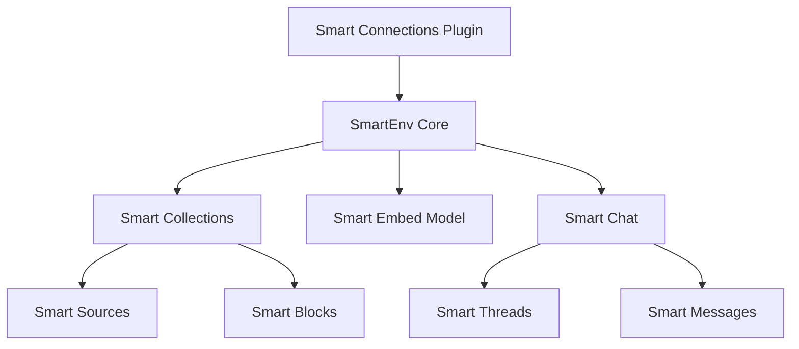

# Development Guide

> **Complete guide for developers working with Enhanced Smart Connections**

## Table of Contents

1. [Development Environment Setup](#development-environment-setup)
2. [Project Structure](#project-structure)
3. [JSBrains Ecosystem](#jsbrains-ecosystem)
4. [Build System](#build-system)
5. [Testing](#testing)
6. [Development Workflow](#development-workflow)
7. [Claude Code Adapter Development](#claude-code-adapter-development)
8. [Contributing](#contributing)
9. [Release Process](#release-process)

## Development Environment Setup

### Prerequisites

| Tool | Version | Purpose |
|------|---------|---------|
| **Node.js** | v18+ | JavaScript runtime |
| **npm** | v8+ | Package management |
| **Git** | v2.30+ | Version control |
| **Obsidian** | v1.0+ | Testing environment |
| **Claude Code CLI** | Latest | AI integration testing |

### Initial Setup

#### 1. Fork and Clone

```bash
# Fork the repository on GitHub first, then:
git clone https://github.com/yourusername/obsidian-smart-connections.git
cd obsidian-smart-connections
```

#### 2. Set Up JSBrains Dependencies

The Smart Connections ecosystem requires specific local dependencies:

```bash
# Create the required directory structure
cd ..
mkdir -p jsbrains

# Clone JSBrains modules
git clone https://github.com/brianpetro/jsbrains.git
cd jsbrains
# The jsbrains repo contains multiple packages

# Clone additional dependencies
cd ..
git clone https://github.com/brianpetro/smart-chat-obsidian.git
git clone https://github.com/brianpetro/smart-context-obsidian.git

# Return to project
cd obsidian-smart-connections
```

#### 3. Install Dependencies

```bash
# Install all npm dependencies
npm install

# Verify file: dependencies are linked correctly
npm ls | grep "file:"
```

#### 4. Environment Configuration

Create a `.env` file for development:

```env
# Auto-deploy to test vaults
DESTINATION_VAULTS=test-vault,dev-vault

# Enable debug logging
DEBUG=smart-connections:*

# Claude Code testing
CLAUDE_CODE_TEST=true
SMART_CONNECTIONS_TEST_VAULT=/path/to/test/vault
```

## Project Structure

```
obsidian-smart-connections/
├── src/                     # Source code
│   ├── adapters/           # Platform/provider adapters
│   │   ├── claude_code_cli_adapter.js
│   │   └── README.md
│   ├── components/         # UI components
│   │   ├── connections.js
│   │   └── lookup.js
│   ├── modals/            # Modal dialogs
│   ├── utils/             # Utility functions
│   ├── views/             # Obsidian views
│   ├── index.js           # Main plugin file
│   └── smart_env.config.js # Plugin configuration
├── smart-chat-v0/          # Legacy chat implementation
├── scripts/                # Build and test scripts
├── docs/                   # Documentation
├── assets/                 # Images and resources
├── esbuild.js             # Build configuration
├── package.json           # Project dependencies
└── manifest.json          # Obsidian plugin manifest
```

### Key Files

| File | Purpose |
|------|---------|
| `src/index.js` | Plugin entry point and lifecycle |
| `src/smart_env.config.js` | SmartEnv configuration |
| `src/adapters/claude_code_cli_adapter.js` | Claude Code integration |
| `smart_env.config.js` | Root environment config |
| `esbuild.js` | Build system configuration |

## JSBrains Ecosystem

### Understanding File Dependencies

The project uses `file:` dependencies for local development:

```json
{
  "dependencies": {
    "smart-collections": "file:../jsbrains/smart-collections",
    "smart-embed-model": "file:../jsbrains/smart-embed-model",
    "smart-chat-obsidian": "file:../smart-chat-obsidian"
  }
}
```

### Working with JSBrains Modules

```bash
# To modify a JSBrains module:
cd ../jsbrains/smart-collections
# Make your changes
npm run build  # If the module has a build step

# Changes are immediately reflected in Smart Connections
cd ../../obsidian-smart-connections
npm run dev
```

### Module Architecture



## Build System

### Build Commands

```bash
# Development build with watch mode
npm run dev

# Production build
npm run build

# Build and release
npm run release
```

### Build Configuration

The `esbuild.js` file configures the build:

```javascript
{
  entryPoints: ['src/index.js'],
  bundle: true,
  external: [
    'obsidian',
    'electron',
    '@codemirror/*',
    'node:*'
  ],
  format: 'cjs',
  target: 'es2022',
  platform: 'node'
}
```

### Custom Build Plugins

- **CSS with Attributes**: Preserves CSS attribute selectors
- **Markdown Import**: Allows importing .md files
- **Auto-deployment**: Copies to test vaults

## Testing

### Test Framework

We use AVA for testing with ES modules support:

```bash
# Run all tests
npm test

# Run specific test file
npx ava src/utils/banner.test.js

# Run tests in watch mode
npx ava --watch

# Run with coverage
npm run test:coverage
```

### Test Categories

#### Unit Tests
```bash
# Component tests
npx ava src/components/*.test.js

# Utility tests
npx ava src/utils/*.test.js
```

#### Integration Tests
```bash
# Claude Code integration
npm run test:claude-code

# Migration system
npx ava src/test/migration_manager.test.js
```

#### Performance Tests
```bash
# Large vault performance
npm run test:claude-code:performance

# Embedding generation speed
npm run test:embeddings:performance
```

### Writing Tests

Example test structure:

```javascript
// src/adapters/claude_code_cli_adapter.test.js
import test from 'ava';
import { ClaudeCodeCLIAdapter } from './claude_code_cli_adapter.js';

test('adapter initializes correctly', async t => {
  const adapter = new ClaudeCodeCLIAdapter();
  t.truthy(adapter);
  t.is(adapter.name, 'Claude Code CLI');
});

test('handles context building', async t => {
  const adapter = new ClaudeCodeCLIAdapter();
  const context = await adapter.buildContext(mockVault);
  t.true(context.length > 0);
});
```

## Development Workflow

### Feature Development

1. **Create a feature branch**
   ```bash
   git checkout -b feature/your-feature-name
   ```

2. **Start development mode**
   ```bash
   npm run dev
   ```

3. **Make changes and test**
   - Edit source files
   - Auto-rebuild on save
   - Test in Obsidian

4. **Run tests**
   ```bash
   npm test
   ```

5. **Commit changes**
   ```bash
   git add .
   git commit -m "feat: add new feature"
   ```

### Debugging

#### Using Obsidian DevTools

1. Open DevTools: `Ctrl/Cmd+Shift+I`
2. Set breakpoints in Sources tab
3. Use Console for debugging:
   ```javascript
   app.plugins.plugins['smart-connections']
   ```

#### Debug Logging

```javascript
// Enable debug logging
if (process.env.DEBUG) {
  console.log('[Smart Connections]', data);
}
```

#### Claude Code Debugging

```bash
# Enable Claude CLI debug mode
export CLAUDE_DEBUG=true
npm run dev

# Monitor Claude process
ps aux | grep claude
```

## Claude Code Adapter Development

### Adapter Architecture

```javascript
// src/adapters/claude_code_cli_adapter.js
export class ClaudeCodeCLIAdapter {
  constructor(env) {
    this.env = env;
    this.process = null;
    this.timeout = 30000;
  }

  async complete(messages, options) {
    // Build context from vault
    const context = await this.buildContext();
    
    // Spawn Claude CLI process
    const response = await this.spawnClaude(messages, context);
    
    // Stream response
    return this.streamResponse(response);
  }
}
```

### Testing the Adapter

```bash
# Unit tests
npx ava src/adapters/claude_code_cli_adapter.test.js

# Integration tests
npm run test:integration:claude-code

# Manual testing
node scripts/test_claude_adapter.js
```

### Performance Optimization

- **Context Caching**: Cache frequently used context
- **Process Pool**: Reuse Claude CLI processes
- **Streaming**: Stream responses for better UX
- **Timeout Handling**: Graceful timeout management

## Contributing

### Code Style

We use ESLint with the following rules:

```javascript
{
  "extends": ["eslint:recommended"],
  "env": {
    "es2022": true,
    "node": true
  },
  "rules": {
    "indent": ["error", 2],
    "quotes": ["error", "single"],
    "semi": ["error", "always"]
  }
}
```

### Commit Convention

Follow conventional commits:

```
feat: add new feature
fix: resolve bug
docs: update documentation
test: add tests
refactor: code refactoring
style: formatting changes
chore: maintenance tasks
```

### Pull Request Process

1. **Fork and create branch**
2. **Make changes with tests**
3. **Update documentation**
4. **Run full test suite**
5. **Submit PR with description**

### Review Checklist

- [ ] Tests pass
- [ ] Documentation updated
- [ ] No console errors
- [ ] Performance impact considered
- [ ] Privacy implications reviewed

## Release Process

### Version Management

```bash
# Bump version (updates package.json and manifest.json)
npm version patch  # 1.0.0 → 1.0.1
npm version minor  # 1.0.0 → 1.1.0
npm version major  # 1.0.0 → 2.0.0
```

### Creating a Release

1. **Update version**
   ```bash
   npm version minor
   ```

2. **Create release notes**
   ```bash
   echo "## Version X.Y.Z" > releases/X.Y.Z.md
   # Add release notes
   ```

3. **Build and test**
   ```bash
   npm run build
   npm test
   ```

4. **Create release package**
   ```bash
   npm run release
   ```

5. **Tag and push**
   ```bash
   git push origin main --tags
   ```

### Release Artifacts

The release creates:
- `main.js` - Compiled plugin
- `manifest.json` - Plugin metadata
- `styles.css` - Plugin styles
- `release-X.Y.Z.zip` - Complete package

## Advanced Topics

### Memory Management

```javascript
// Clean up resources
onunload() {
  this.cleanupProcesses();
  this.clearCaches();
  this.saveState();
}
```

### Performance Profiling

```javascript
// Profile function execution
console.time('embedding-generation');
await this.generateEmbeddings();
console.timeEnd('embedding-generation');
```

### Security Considerations

- Sanitize user inputs
- Validate file paths
- Handle process spawning safely
- Protect sensitive data

## Resources

### Documentation

- [Architecture Overview](./architecture.md)
- [User Guide](./user-guide.md)
- [Claude Code Integration](./claude-code-integration.md)

### External Resources

- [Obsidian API Docs](https://docs.obsidian.md)
- [JSBrains Documentation](https://github.com/brianpetro/jsbrains)
- [Claude Code CLI Docs](https://claude.ai/code/docs)

### Community

- [GitHub Issues](https://github.com/yourusername/obsidian-smart-connections/issues)
- [Obsidian Forum](https://forum.obsidian.md)
- [Discord Community](https://discord.gg/obsidianmd)

---

[← Installation](./installation.md) | [Architecture →](./architecture.md)