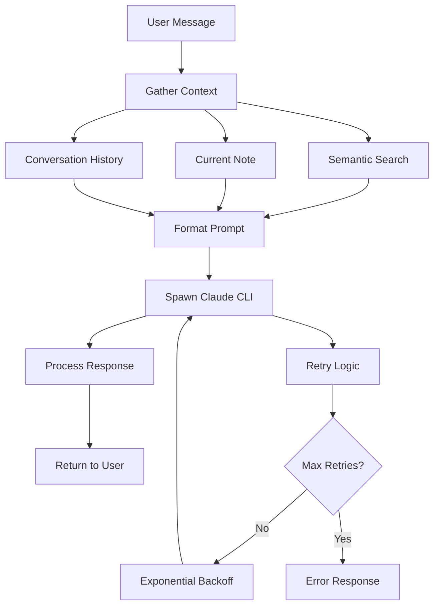

# Claude Code CLI Adapter

This adapter integrates Claude Code CLI with Smart Connections, providing AI completions using your local Claude Code CLI installation instead of external API providers.

## Features

- **Local Processing**: Uses Claude Code CLI installed on your system
- **Smart Context**: Automatically includes relevant vault content using semantic search
- **Conversation History**: Maintains context from previous messages
- **Streaming Support**: Real-time response streaming
- **Retry Logic**: Exponential backoff with configurable retry attempts
- **Process Management**: Proper timeout and cleanup handling
- **Error Handling**: Graceful fallbacks and user feedback

## Prerequisites

1. **Claude Code CLI**: Must be installed and available in your PATH
   ```bash
   # Install Claude Code CLI (if not already installed)
   # Follow installation instructions from Claude Code documentation
   
   # Verify installation
   claude --version
   ```

2. **Smart Connections**: This adapter is designed to work with the Smart Connections plugin for Obsidian

## Configuration

The adapter is automatically configured in `smart_env.config.js` with these default settings:

```javascript
smart_chat_model: {
  claude_code_cli: {
    timeout: 60000,      // 60 seconds
    max_retries: 3,      // Maximum retry attempts
    base_delay: 1000,    // Base delay for exponential backoff (1 second)
    context_limit: 5,    // Number of semantic search results to include
  }
}
```

## Usage

### Programmatic Usage

```javascript
import { ClaudeCodeCLIAdapter } from './claude_code_cli_adapter.js';

// Initialize with SmartChatModel instance
const adapter = new ClaudeCodeCLIAdapter(smartChatModel);

// Test connection
const isAvailable = await adapter.test_connection();

// Non-streaming completion
const response = await adapter.complete({
  messages: [
    { role: 'user', content: 'Help me understand my vault contents' }
  ]
});

// Streaming completion
await adapter.stream({
  messages: [
    { role: 'user', content: 'What should I work on next?' }
  ]
}, {
  chunk: (chunk) => console.log(chunk.content),
  done: (response) => console.log('Complete!'),
  error: (error) => console.error('Error:', error)
});

// Cleanup when done
adapter.cleanup();
```

### Smart Connections Integration

The adapter is automatically available in Smart Connections once configured. Select "Claude Code CLI" as your AI provider in the plugin settings.

## How It Works

### Context Intelligence

1. **Current Note Context**: Includes content from the currently active note
2. **Semantic Search**: Finds related content using Smart Connections' search capability
3. **Conversation History**: Maintains context from previous messages in the conversation

### Process Flow



### Error Handling

- **CLI Not Found**: Clear error message with installation instructions
- **Timeout**: Configurable timeout with process cleanup
- **Process Errors**: Proper error capture and user feedback
- **Retry Logic**: Exponential backoff for temporary failures

## API Reference

### ClaudeCodeCLIAdapter

#### Constructor
```javascript
new ClaudeCodeCLIAdapter(main)
```
- `main`: SmartChatModel instance with environment access

#### Methods

##### `validate_connection()`
Tests if Claude Code CLI is available.
- **Returns**: `Promise<boolean>` - True if CLI is available

##### `gather_context(user_message)`
Gathers semantic context from vault.
- **Parameters**: `user_message` - User's message to search context for
- **Returns**: `Promise<string>` - Formatted context string

##### `format_prompt(messages)`
Formats prompt with context and conversation history.
- **Parameters**: `messages` - Array of conversation messages
- **Returns**: `Promise<string>` - Formatted prompt

##### `complete(request)`
Non-streaming completion.
- **Parameters**: `request` - Request object with messages array
- **Returns**: `Promise<Object>` - Completion response

##### `stream(request, handlers)`
Streaming completion.
- **Parameters**: 
  - `request` - Request object with messages array
  - `handlers` - Object with chunk, done, and error handlers
- **Returns**: `Promise<void>`

##### `test_connection()`
Tests connection with user feedback.
- **Returns**: `Promise<boolean>` - True if successful

##### `cleanup()`
Cleanup method for resource management.

#### Properties

##### `models`
Array of available model configurations.
- **Returns**: `Array<Object>` - Model configurations

##### `can_stream`
Whether streaming is supported.
- **Type**: `boolean`

## Configuration Options

| Option | Type | Default | Description |
|--------|------|---------|-------------|
| `timeout` | number | 60000 | Maximum time to wait for CLI response (ms) |
| `max_retries` | number | 3 | Number of retry attempts on failure |
| `base_delay` | number | 1000 | Base delay for exponential backoff (ms) |
| `context_limit` | number | 5 | Max semantic search results to include |

## Troubleshooting

### Common Issues

1. **"Claude Code CLI not found"**
   - Ensure Claude Code CLI is installed and in PATH
   - Try running `claude --version` in terminal

2. **Timeout errors**
   - Increase timeout setting
   - Check system resources and CLI responsiveness

3. **No context retrieved**
   - Verify Smart Connections is properly configured
   - Check that vault content is indexed

4. **Permission errors**
   - Ensure Claude Code CLI has necessary permissions
   - Check file system access rights

### Debug Mode

Enable debug logging by setting the environment variable:
```bash
DEBUG=claude-code-adapter node your-script.js
```

## Testing

Run the test suite:
```bash
npx ava src/adapters/claude_code_cli_adapter.test.js
```

The tests cover:
- Adapter initialization
- Context gathering
- Prompt formatting
- Error handling
- Connection validation
- Streaming functionality

## Examples

See `claude_code_cli_adapter_example.js` for complete usage examples including:
- Basic completion
- Streaming responses
- Smart Connections integration
- Settings configuration
- Error handling patterns

## Contributing

When modifying this adapter:

1. Maintain backward compatibility with existing configurations
2. Update tests for new functionality
3. Follow the existing error handling patterns
4. Update documentation for any API changes
5. Test with actual Claude Code CLI installation

## License

This adapter is part of the Smart Connections project and follows the same licensing terms.