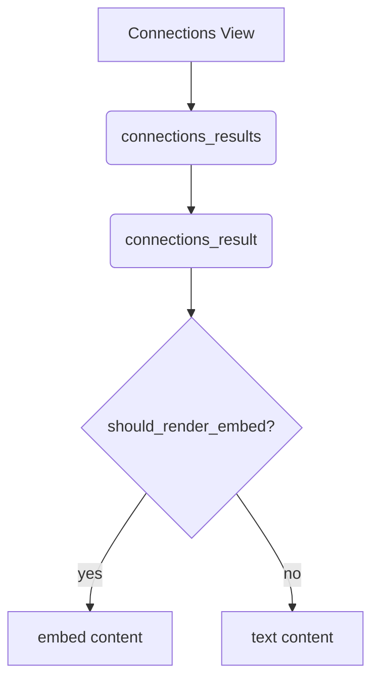

## Overview

This directory contains UI components used by the Smart Connections plugin. Each component exposes `build_html`, `render` and `post_process` functions and returns a `DocumentFragment` ready for insertion.

| File | Description |
| ---- | ----------- |
| `connections.js` | Renders the header and list container for the connections pane. |
| `connections_results.js` | Iterates over connection results and delegates to `connections_result.js`. |
| `connections_result.js` | Handles individual result rendering and expansion logic. Includes helper functions `should_render_embed` and `process_for_rendering`. |
| `lookup.js` | Implements the Smart Lookup interface. |
| `main_settings.js` | Builds the main settings tab. |
| `muted_notices.js` | Displays user muted notices. |
| `source_inspector.js` | Shows detailed blocks for a source. |
