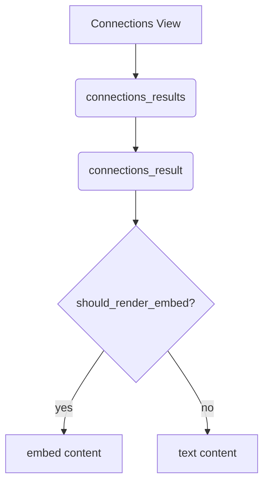

## Overview

This directory houses UI components for the Smart Connections plugin. Each file exports `build_html`, `render` and `post_process` helpers that assemble the DOM for the plugin views.

| File | Description |
| ---- | ----------- |
| `connections.js` | Builds the Connections view wrapper and top‑bar buttons. |
| `connections_results.js` | Renders result lists by delegating each item to `connections_result.js`. |
| `connections_result.js` | Handles single result expansion and context menus. |
| `connections_v1.js` | Deprecated first version kept for early‑release compatibility. |
| `lookup.js` | Implements the Smart Lookup search view. |
| `main_settings.js` | Builds the settings tab with links to help docs. |
